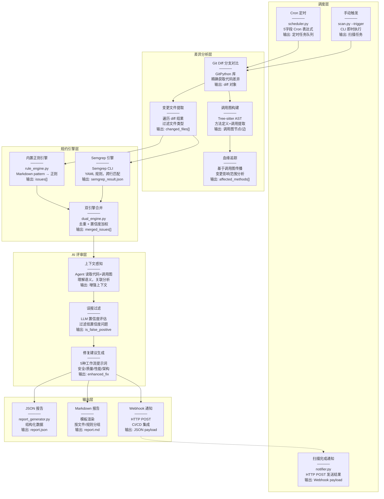

# 代码评审工具 (Code Review Skill)

自动化代码评审工具，支持分支差异扫描、调用链分析、多规约（设计/实现/安全）自动评审，输出结构化问题报告与修复建议。

**核心设计理念**：
- **Agent 主导**：Agent 自身就是 LLM，直接执行评审，无需外部 API
- **离线优先**：所有核心功能离线可用，最小化外部依赖
- **脚本辅助**：Python 脚本只负责 Git diff 提取、文件解析、报告格式化

---

## 引导提示词

以下是触发本 Skill 的典型提示词，Agent 会根据这些关键词自动激活代码评审能力：

### 基础扫描

```
帮我扫描一下 release/1.0 分支和 master 分支的代码差异，看看有没有安全问题
```

```
对当前仓库执行代码评审，使用默认规约
```

```
检查一下这个 PR 有没有安全漏洞
```

### 指定规约

```
用安全规约扫描一下这个仓库，重点关注 XXE 和 SQL 注入
```

```
使用严格模式评审代码，所有规约提升为 ERROR 级别
```

```
只检查安全相关的规约，跳过设计和命名规范
```

### 调用链分析

```
分析 release 分支的变更代码，找出所有受影响的方法和调用链
```

```
追踪这个变更的影响范围，看看哪些下游方法会受到影响
```

### 自定义规则

```
帮我添加一条自定义规则：检查日志中是否打印了密码
```

```
创建一个针对我们团队的规约：所有 API 必须使用统一返回格式
```

### 测试验证

```
运行规则测试，验证所有安全规约是否正确生效
```

```
检查测试案例目录，看看哪些规则还没有测试覆盖
```

---

## 工作流概览

Skill 执行时会自动完成以下步骤：

```
Step 0: 环境准备
├─ 检测 Python 版本
├─ 安装依赖（离线包优先，无需网络）
└─ 检测 Semgrep 是否可用（可选增强）

Step 1: 需求分析
├─ 识别用户意图（全量扫描/安全扫描/严格审查）
├─ 评估仓库规模（小/中/大）
└─ 选择规约 Profile（default/strict/minimal）

Step 2: 数据提取（Python 脚本辅助）
├─ Git 差异分析（提取变更文件和方法）
├─ 调用图构建（追踪血缘关系）
└─ 读取规约文件（references/）

Step 3: Agent 评审（核心）
├─ Agent 读取规约 Markdown
├─ Agent 分析变更代码
├─ Agent 执行评审（利用自身 LLM 能力）
├─ Agent 过滤误报（基于上下文理解）
└─ Agent 生成修复建议

Step 4: 报告生成（Python 脚本辅助）
├─ 格式化报告（JSON + Markdown）
├─ 统计摘要（按规约类型、严重等级、文件维度）
└─ 输出到 report/ 目录
```

详细工作流说明请参考 [SKILL.md](.trae/skills/code-review/SKILL.md)。

---

## 技术栈

### 核心技术层次

```
Level 3: Agent 评审（核心）
├─ Agent 自身就是 LLM，直接执行评审
├─ 上下文理解，过滤误报
├─ 生成修复建议和分析说明
└─ 无需外部 API，离线可用
    ↓
Level 2: Semgrep 规则引擎（可选增强）
├─ 跨行模式匹配
├─ 数据流分析（source → sink）
├─ 多文件关联分析
└─ 需要安装 Semgrep（可选）
    ↓
Level 1: Tree-sitter AST 解析（精确语法分析）
├─ 方法定义提取（比正则更准确）
├─ 调用图构建（方法间调用关系）
├─ 多语言支持（Java/Python/JavaScript）
└─ 离线可用（已集成）
    ↓
Level 0: Git 差异分析（变更检测）
├─ 分支对比（release vs master）
├─ 变更文件提取
├─ 变更方法定位
└─ 离线可用（已集成）
```

### 技术选型对比

| 技术 | 精准度 | 性能 | 适用场景 | 外部依赖 | 当前状态 |
|------|--------|------|----------|----------|----------|
| **Agent 评审** | ⭐⭐⭐⭐⭐ | ⭐⭐⭐⭐ | 核心评审，上下文理解 | 无 | ✅ 已集成 |
| **Semgrep** | ⭐⭐⭐⭐⭐ | ⭐⭐⭐ | 跨行模式、数据流分析 | 需安装 | ⚠️ 可选 |
| **Tree-sitter** | ⭐⭐⭐⭐⭐ | ⭐⭐⭐⭐ | AST 解析、调用图 | 无 | ✅ 已集成 |
| **GitPython** | ⭐⭐⭐⭐ | ⭐⭐⭐⭐ | 分支差异、变更检测 | 无 | ✅ 已集成 |

### 外部依赖分析

| 依赖 | 是否必须 | 用途 | 离线可用 |
|------|----------|------|----------|
| **Python 3.8+** | ✅ 必须 | 运行环境 | ✅ |
| **pyyaml** | ✅ 必须 | YAML 解析 | ✅ |
| **gitpython** | ✅ 必须 | Git 操作 | ✅ |
| **tree-sitter** | ✅ 必须 | AST 解析 | ✅ |
| **rich** | ✅ 必须 | 终端输出 | ✅ |
| **Semgrep** | ❌ 可选 | 精准模式匹配 | ✅（如果已安装） |
| **外部 LLM API** | ❌ 不需要 | Agent 自身就是 LLM | - |

**核心优势**：所有核心功能离线可用，无需外部 API 调用。

详细技术分析请参考 [TECH-STACK.md](docs/TECH-STACK.md)。

---

## 架构总览



### 架构说明

上图展示了代码评审工具的完整数据流。每个方格包含四行信息：
- **第一行**：模块名称
- **第二行**：实现方式（核心代码/技术）
- **第三行**：功能效果
- **第四行**：输出数据格式

**数据流向**：
1. **调度层** → 触发扫描任务（Cron 定时 / 手动触发两种方式）
2. **差异分析层** → 提取变更文件和调用关系（Git Diff + Tree-sitter）
3. **规约引擎层** → 双引擎并行扫描（内置正则 + Semgrep）
4. **AI 评审层** → 上下文感知、误报过滤、修复建议（Agent 主导）
5. **输出层** → 生成报告和通知（JSON/Markdown/Webhook）
6. **扫描完成通知** → 通过 Webhook 将结果发送到外部系统

---

## 各层实现原理详解

### 调度层

| 模块 | 实现方式 | 效果 | 输出 |
|------|----------|------|------|
| **Cron 定时** | `scheduler.py` 内置 Cron 解析器，支持标准 5 字段表达式 | 定期自动触发扫描，无需人工干预 | 定时任务队列 |
| **手动触发** | `scan.py --trigger` CLI 参数 | 即时执行扫描，支持紧急检查 | 立即启动扫描流程 |
| **扫描完成通知** | `notifier.py` 通过 HTTP POST 发送扫描结果 | 将结果推送到外部系统（钉钉/飞书/Slack 等） | JSON payload |

### 差异分析层

| 模块 | 实现方式 | 效果 | 输出 |
|------|----------|------|------|
| **Git Diff 分支对比** | GitPython 库，`repo.commit(base).diff(target)` | 精确获取两个分支的代码差异 | 差异文件列表、变更行号 |
| **变更文件提取** | 遍历 diff 结果，过滤文件类型 | 聚焦实际代码变更，跳过二进制/配置 | `changed_files: [{path, status, additions, deletions}]` |
| **调用图构建** | Tree-sitter AST 解析，提取方法定义和调用 | 建立方法间调用关系图 | 调用图节点和边，支持多语言 |
| **血缘追踪** | 基于调用图传播变更影响 | 识别变更的上下游影响范围 | `affected_methods: [方法列表]`，变更影响扇出 |

### 规约引擎层

| 模块 | 实现方式 | 效果 | 输出 |
|------|----------|------|------|
| **内置正则引擎** | `rule_engine.py` 将 Markdown pattern 转换为正则 | 快速模式匹配，离线可用 | 问题列表 `[{rule_id, file, line, severity}]` |
| **Semgrep 引擎** | 调用 Semgrep CLI，YAML 规则格式 | 跨行模式匹配，数据流分析 | Semgrep JSON 输出，精准度高 |
| **双引擎合并** | `dual_engine.py` 合并结果，去重 | 结合两者优势，提高检出率 | 去重后的问题列表，标注检出引擎 |

### AI 评审层

| 模块 | 实现方式 | 效果 | 输出 |
|------|----------|------|------|
| **上下文感知** | Agent 读取代码上下文、调用图、diff | 理解代码语义，避免误报 | 增强的问题上下文 |
| **误报过滤** | LLM 评估置信度，过滤低置信度问题 | 减少噪音，提高准确性 | `is_false_positive: bool`，`ai_confidence: float` |
| **修复建议生成** | 5 种工作流提示词（安全/质量/性能/架构/综合） | 提供针对性的修复代码 | `enhanced_fix: string`，工作流特定字段 |

### 输出层

| 模块 | 实现方式 | 效果 | 输出 |
|------|----------|------|------|
| **JSON 报告** | `report_generator.py` 序列化问题列表 | 结构化数据，便于程序处理 | `report.json`，包含所有问题详情 |
| **Markdown 报告** | 模板渲染，按文件/规则分组 | 人类可读，便于审查 | `report.md`，包含统计摘要和修复建议 |
| **Webhook 通知** | HTTP POST 到配置的 URL | 集成 CI/CD 流水线，实时通知 | JSON payload，包含扫描结果摘要 |

---

## 能力域地图

### 核心能力覆盖

| 能力域 | 实现状态 | 技术方案 | 说明 |
|--------|----------|----------|------|
| **分支 Diff 扫描** | ✅ 已实现 | GitPython | 支持 `--base` / `--target` 分支对比 |
| **调用链/血缘分析** | ✅ 已实现 | Tree-sitter | 方法级调用图，影响范围追踪 |
| **自定义规约体系** | ✅ 已实现 | Markdown + YAML | 分层目录（设计/实现/安全），Profile 配置 |
| **安全漏洞检测** | ✅ 已实现 | 双引擎 | 12 类安全规约，覆盖 OWASP Top 10 |
| **AI 辅助评审** | ✅ 已实现 | 多工作流 | 5 种工作流（安全/质量/性能/架构/综合） |
| **定期扫描调度** | ✅ 已实现 | Cron + Webhook | 定时扫描 + 结果通知 |
| **CI/CD 集成** | ✅ 已实现 | CLI | 可嵌入 GitHub Actions / GitLab CI |
| **离线运行** | ✅ 已实现 | 无外部依赖 | 核心功能全部离线可用 |

### 与业界工具能力对比

| 能力域 | 本项目 | Semgrep | CodeQL | SonarQube | Open Code Review |
|--------|--------|---------|--------|-----------|------------------|
| 分支 Diff 扫描 | ✅ 原生 | ✅ baseline | ✅ PR 集成 | ✅ PR 装饰器 | ✅ --from/--to |
| 调用链/血缘分析 | ✅ Tree-sitter | ⚠️ 数据流 | ✅ 污点追踪 | ⚠️ 有限 | ⚠️ 上下文窗口 |
| 自定义规约体系 | ✅ Markdown | ✅ YAML | ✅ QL 查询 | ✅ 插件 | ✅ 项目/用户规则 |
| 安全漏洞检测 | ✅ 12 类 | ✅ OWASP Top 10 | ✅ 全覆盖 | ✅ 安全热点 | ⚠️ 4 类微调规则 |
| AI 辅助评审 | ✅ 多工作流 | ❌ | ❌ | ❌ | ✅ 混合架构 |
| 离线运行 | ✅ 完全离线 | ✅ | ❌ 需云端 | ❌ 需服务端 | ⚠️ 需 API |
| 定期扫描调度 | ✅ 内置 Cron | ⚠️ 需外部 | ✅ GitHub | ✅ 内置 | ❌ 需外部 |

---

## 项目结构

```
code-review-skill/
├── .trae/skills/code-review/
│   └── SKILL.md              # Agent Skill 定义（含完整工作流）
├── docs/                     # 文档目录
│   ├── guides/               # 使用指南
│   ├── reports/              # 报告目录
│   └── *.md                  # 项目文档
├── references/               # 规约库（Markdown 格式，人机都好维护）
│   ├── design/               # 设计规约（架构、API、数据库）
│   ├── implementation/       # 代码实现规约（命名、异常、并发、空指针）
│   ├── security/             # 安全规约（12 类，覆盖 OWASP Top 10）
│   ├── rules/                # 自定义业务规则
│   ├── profiles/             # 规约配置（YAML，控制启用哪些规约）
│   ├── prompts/              # AI 评审工作流提示词（5 种工作流）
│   └── test-cases/           # 测试案例（验证规则是否正确生效）
│       ├── security/         # 安全规约测试案例
│       ├── design/           # 设计规约测试案例
│       └── implementation/   # 实现规约测试案例
├── scripts/                  # Python 工程脚本
│   ├── scan.py               # 主扫描入口
│   ├── diff_analyzer.py      # 分支差异分析
│   ├── call_graph.py         # 调用图构建与血缘分析
│   ├── rule_engine.py        # 规则引擎（Semgrep 集成，可选）
│   ├── report_generator.py   # 报告生成（JSON + Markdown）
│   └── test_rules.py         # 规则测试脚本
├── test-validation/          # 测试验证数据
├── tests/                    # 单元测试
├── offline-packages/         # 离线依赖包（20 个包，约 19MB）
├── config.yaml               # 全局配置
├── requirements.txt          # Python 依赖
└── README.md
```

详细目录结构说明请参考 [DIRECTORY-STRUCTURE.md](docs/DIRECTORY-STRUCTURE.md)。

---

## 快速开始

### 1. 安装依赖

**优先使用离线安装**（无需网络，更快）：

```bash
cd code-review-skill

# 检查离线包是否存在
if [ -d "offline-packages" ] && [ "$(ls -A offline-packages)" ]; then
    echo "使用离线安装..."
    pip3 install --no-index --find-links=offline-packages -r requirements.txt
else
    echo "使用在线安装..."
    pip3 install -r requirements.txt --break-system-packages
fi

# 可选：安装 Semgrep 规则引擎（精准度更高，不是必须的）
brew install semgrep  # macOS
# 或 pip3 install semgrep --break-system-packages
```

**离线包说明**：
- 位置：`offline-packages/`
- 大小：约 19MB
- 包含：20 个依赖包（pyyaml, gitpython, tree-sitter, pandas 等）
- 适用：无网络环境或网络不稳定时

详细安装说明请参考 [OFFLINE-INSTALL.md](docs/guides/OFFLINE-INSTALL.md)。

### 2. 执行扫描

```bash
python scripts/scan.py \
  --repo /path/to/your/repo \
  --base master \
  --target release/1.0 \
  --profile default \
  --workflow comprehensive \
  --output report/
```

**参数说明**：
- `--repo`: 仓库路径
- `--base`: 基线分支（如 master）
- `--target`: 目标分支（如 release/1.0）
- `--profile`: 规约 Profile（default/strict/minimal）
- `--workflow`: AI 评审工作流（security/quality/performance/architecture/comprehensive）
- `--output`: 报告输出目录

**AI 工作流说明**：

| 工作流 | 适用场景 | 特色输出 |
|--------|----------|----------|
| `security` | 安全漏洞扫描、合规检查 | 攻击向量、CVSS 评分、CWE 编号 |
| `quality` | 代码审查、技术债务评估 | 代码异味、可维护性、技术债务 |
| `performance` | 性能瓶颈分析、优化建议 | 性能影响量化、优化策略、预期收益 |
| `architecture` | 架构评审、设计模式检查 | 架构影响、设计违反、耦合度评估 |
| `comprehensive` | 通用代码评审（默认） | 综合分析、平衡深度 |

### 3. 查看报告

报告输出到 `report/` 目录：
- `report.json` - 结构化 JSON 报告
- `report.md` - 可读的 Markdown 报告
- `summary.json` - 统计摘要

### 4. 运行测试

```bash
# 运行所有规则测试
python scripts/test_rules.py

# 详细输出
python scripts/test_rules.py --verbose

# 保存测试报告
python scripts/test_rules.py --output test-report.json
```

---

## 规约库

### 安全规约覆盖（12 类）

| 安全类别 | CWE 编号 | 规则文件 | 风险等级 | 检测说明 |
|----------|----------|----------|----------|----------|
| 越权访问 | CWE-862 / CWE-863 | `security/authorization.md` | CRITICAL | 接口缺少鉴权注解，水平/垂直越权模式 |
| XXE | CWE-611 | `security/xxe.md` | HIGH | XML 解析器未禁用外部实体 |
| XSS | CWE-79 | `security/xss.md` | HIGH | 未转义用户输入直接输出到 HTML/JS |
| 目录穿越 | CWE-22 | `security/path-traversal.md` | HIGH | 文件路径拼接用户输入未做规范化 |
| 提权/命令注入 | CWE-250 / CWE-78 | `security/privilege-escalation.md` | CRITICAL | 低权限执行高权限操作，命令注入 |
| 签名绕过 | CWE-345 / CWE-347 | `security/signature-bypass.md` | CRITICAL | 签名验证不完整，密钥硬编码 |
| SQL 注入 | CWE-89 | `security/sql-injection.md` | CRITICAL | 字符串拼接 SQL，占位符滥用 |
| SSRF | CWE-918 | `security/ssrf.md` | HIGH | 用户可控 URL 未做白名单限制 |
| 硬编码密钥 | CWE-798 | `security/hardcoded-secrets.md` | HIGH | 密码/Token 硬编码在源码中 |
| 反序列化 | CWE-502 | `security/deserialization.md` | CRITICAL | 不安全的反序列化操作 |
| 日志注入 | CWE-117 | `security/log-injection.md` | MEDIUM | 日志中未转义用户输入 |
| 弱随机数 | CWE-330 | `security/weak-randomness.md` | MEDIUM | 安全敏感场景使用弱随机数 |

### 设计规约（3 类）

| 规约类别 | 规则文件 | 检测说明 |
|----------|----------|----------|
| 架构合规 | `design/architecture.md` | 分层依赖检查，循环引用检测 |
| API 设计 | `design/api-design.md` | RESTful 规范，命名规范，返回值规范 |
| 数据库设计 | `design/database.md` | N+1 查询检测，事务管理，索引建议 |

### 实现规约（4 类）

| 规约类别 | 规则文件 | 检测说明 |
|----------|----------|----------|
| 命名规范 | `implementation/naming.md` | 常量/变量/方法命名约定 |
| 异常处理 | `implementation/error-handling.md` | 空 catch 块，裸 except，异常吞没 |
| 并发安全 | `implementation/concurrency.md` | 线程安全，竞态条件，死锁风险 |
| 空指针防护 | `implementation/null-safety.md` | 未判空调用，自动拆箱，Optional 使用 |

### 测试案例

每个规约都有对应的测试案例，位于 `references/test-cases/` 目录：

```
test-cases/
├── security/
│   ├── xxe-test.md           # XXE 违规/正确代码样本
│   ├── xss-test.md           # XSS 违规/正确代码样本
│   └── ...
├── design/
│   ├── architecture-test.md  # 架构合规测试
│   └── ...
└── implementation/
    ├── naming-test.md        # 命名规范测试
    └── ...
```

每个测试案例包含：
- **违规代码样本**：应该被检测到的代码
- **正确代码样本**：不应该被检测到的代码
- **预期命中规则**：明确标注应该命中的规则 ID

### 自定义规则

在 `references/rules/custom.md` 中添加规则，用 `---` 分隔不同规则：

```markdown
# 我的规则 - 简要描述

> 一句话说明

```yaml
id: custom-my-rule
languages: [java]
severity: WARNING
category: custom
```

## 检测模式

```pattern
your_pattern_here
```
```

### 规约 Profile

- `default` - 启用全部规约
- `strict` - 所有规约提升为 ERROR
- `minimal` - 仅安全 + 关键实现规约

---

## 定期扫描

### 配置 Cron 定时扫描

编辑 `config.yaml`：

```yaml
schedule:
  cron: "0 2 * * *"  # 每天凌晨 2 点
  notify: true
  notify_method: "webhook"
  notify_target: "https://hooks.example.com/scan-result"
```

### CI/CD 集成

```yaml
# GitHub Actions 示例
name: Code Review
on:
  push:
    branches: [release/*]
jobs:
  review:
    runs-on: ubuntu-latest
    steps:
      - uses: actions/checkout@v4
      - uses: actions/setup-python@v5
        with:
          python-version: '3.11'
      - run: pip install -r requirements.txt
      - run: python scripts/scan.py --repo . --base master --target HEAD --output report/
      - run: python scripts/test_rules.py --output test-report.json
      - uses: actions/upload-artifact@v4
        with:
          name: review-report
          path: |
            report/
            test-report.json
```

---

## 评审流水线

```mermaid
flowchart TD
    START(["触发评审
    ─────
    scheduler.py / scan.py
    Cron 定时或手动触发
    输出: 扫描任务"]) --> DIFF["获取分支差异
    ─────
    diff_analyzer.py
    GitPython 库
    release vs master 对比
    输出: changed_files[]"]
    
    DIFF --> CG["构建调用图 + 血缘分析
    ─────
    call_graph.py
    Tree-sitter AST 解析
    方法级调用关系图
    输出: call_graph.json"]

    CG --> PARALLEL

    subgraph PARALLEL["并行评审（3 类规约）"]
        direction LR
        R1["设计规约评审
        ─────
        rule_engine.py
        内置正则 + Semgrep
        架构合规 / API 规范
        输出: design_issues[]"]
        
        R2["实现规约评审
        ─────
        rule_engine.py
        内置正则 + Semgrep
        命名 / 异常 / 并发
        输出: impl_issues[]"]
        
        R3["安全规约评审
        ─────
        rule_engine.py
        内置正则 + Semgrep
        越权 / XXE / XSS
        输出: security_issues[]"]
    end

    PARALLEL --> AGG["结果聚合
    ─────
    dual_engine.py
    合并三类规约检出结果
    去重、排序
    输出: merged_issues[]"]
    
    AGG --> AI["AI Agent 二次评审
    ─────
    ai_reviewer.py
    上下文关联分析
    误报过滤（置信度评估）
    修复建议生成
    输出: reviewed_issues[]"]
    
    AI --> REPORT["生成评审报告
    ─────
    report_generator.py
    JSON 结构化报告
    Markdown 可读报告
    按版本库聚合问题
    输出: report.json / report.md"]
    
    REPORT --> END(["输出 / 通知
    ─────
    notifier.py
    本地报告文件
    Webhook 通知
    CI/CD 集成
    输出: 文件 + HTTP POST"])
```



### 评审流水线说明

上图展示了从触发评审到输出报告的完整流程。每个步骤包含四行信息：
- **第一行**：步骤名称
- **第二行**：实现方式（核心代码/技术）
- **第三行**：功能效果
- **第四行**：输出数据格式

**关键流程**：
1. **触发评审** → 通过 Cron 定时或手动触发启动扫描
2. **获取分支差异** → 使用 GitPython 提取变更文件列表
3. **构建调用图** → 使用 Tree-sitter 分析方法级调用关系
4. **并行评审** → 三类规约（设计/实现/安全）同时执行，使用内置正则引擎和 Semgrep
5. **结果聚合** → 合并三类规约的检出结果，去重排序
6. **AI 二次评审** → Agent 进行上下文关联分析，过滤误报，生成修复建议
7. **生成报告** → 输出 JSON 和 Markdown 格式的报告
8. **输出/通知** → 保存本地文件，通过 Webhook 推送到外部系统

---

## 验证效果

### 规则测试

运行 `python scripts/test_rules.py` 验证规则引擎：

```
测试完成: 总计 75 | 通过 75 | 失败 0
通过率: 100%
```

### 实际扫描验证

使用 `test-validation/` 目录中的测试代码库验证扫描效果：

| 指标 | 结果 |
|------|------|
| 总已知问题数 | 26 |
| 已检出 | 24 |
| 漏报 | 2 |
| **检出率** | **92.3%** |
| 安全文件误报 | 14 |

### 按语言统计

| 语言 | 检出/总数 | 检出率 |
|------|-----------|--------|
| Java | 8/8 | 100% |
| Python | 10/10 | 100% |
| TypeScript | 6/8 | 75% |

### 按漏洞类型统计

| 漏洞类型 | 检出/总数 | 检出率 |
|----------|-----------|--------|
| 路径穿越 | 5/5 | 100% |
| 提权/命令注入 | 4/4 | 100% |
| SQL 注入 | 2/2 | 100% |
| XXE | 5/5 | 100% |
| XSS | 5/6 | 83.3% |
| SSRF | 3/4 | 75% |

### 单元测试

运行 `python -m pytest tests/` 验证全部模块：

```
267 passed, 6 skipped in 10.17s
```

---

## 扩展

- **新增安全规则**: 在 `references/security/` 下添加 Markdown
- **新增设计规约**: 在 `references/design/` 下添加 Markdown
- **新增测试案例**: 在 `references/test-cases/` 对应子目录下添加测试
- **接入新语言**: 在 `scripts/call_graph.py` 中添加 Tree-sitter 解析器
- **自定义报告**: 扩展 `scripts/report_generator.py`

---

## 常见问题

### Q1: 为什么不需要 AI API Key？

**A**: 
- **Agent 本身就是 LLM**：Skill 在 AI Agent 内部执行，Agent 自身就是大语言模型
- **无需外部调用**：Agent 直接读取规约、分析代码、执行评审，不需要调用外部 API
- **离线可用**：所有核心功能离线可用，无需网络连接

### Q2: Agent 评审和 Semgrep 评审有什么区别？

**A**: 
- **Agent 评审**：利用 Agent 自身的 LLM 能力，理解代码上下文，过滤误报，生成修复建议。**无需外部 API，离线可用**。默认推荐。
- **Semgrep 评审**：使用 Semgrep 工具进行精准模式匹配，支持跨行模式和数据流分析。**需要安装 Semgrep**。可选增强。
- **建议**：默认使用 Agent 评审（无需外部依赖），如果安装了 Semgrep 可以结合使用（Agent + Semgrep 双重评审）。

### Q3: 离线安装和在线安装有什么区别？

**A**: 
- **离线安装**：使用 `offline-packages/` 目录中的预下载包，无需网络，安装更快
- **在线安装**：从 PyPI 下载依赖包，需要网络连接
- **建议**：优先使用离线安装，如果失败再切换到在线安装

### Q4: 如何优化大仓库的扫描性能？

**A**: 
1. **增量扫描**：只扫描变更文件（提升 10x-100x）
2. **分批处理**：大仓库分批评审，避免超出上下文限制
3. **文件过滤**：跳过测试文件和生成文件
4. **并行处理**：多个文件并行分析（如果 Agent 支持）

### Q5: 如何添加自定义规则？

**A**: 
1. 编辑 `references/rules/custom.md`
2. 按照 Markdown 规约格式添加规则
3. 运行 `python scripts/test_rules.py` 验证规则是否正确生效

---

## 相关文档

- [SKILL.md](.trae/skills/code-review/SKILL.md) - 完整工作流说明
- [TECH-STACK.md](docs/TECH-STACK.md) - 技术栈详细分析
- [OFFLINE-INSTALL.md](docs/guides/OFFLINE-INSTALL.md) - 离线安装说明
- [IMPLEMENTATION-PLAN.md](docs/IMPLEMENTATION-PLAN.md) - 实施规划文档
- [COMPLETION-REPORT.md](docs/COMPLETION-REPORT.md) - 完成报告
- [DIRECTORY-STRUCTURE.md](docs/DIRECTORY-STRUCTURE.md) - 目录结构说明
- [ITERATION-REPORT.md](docs/ITERATION-REPORT.md) - 迭代改进报告
