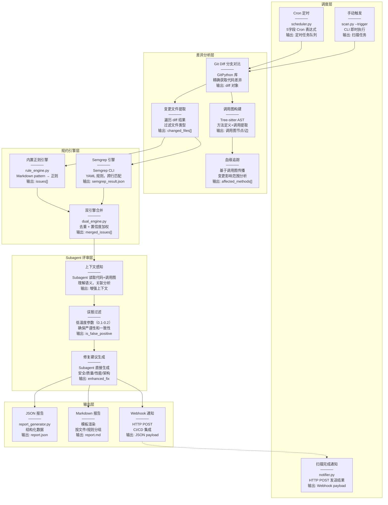
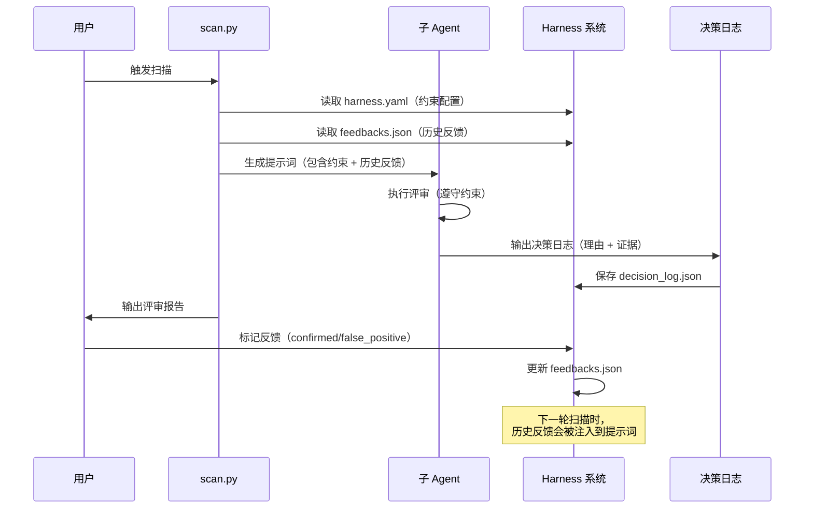
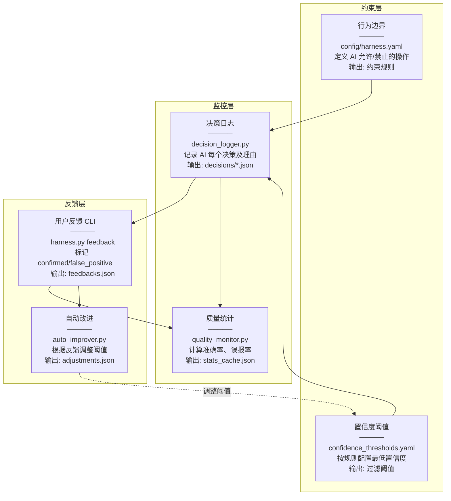
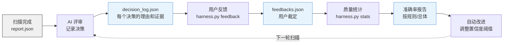
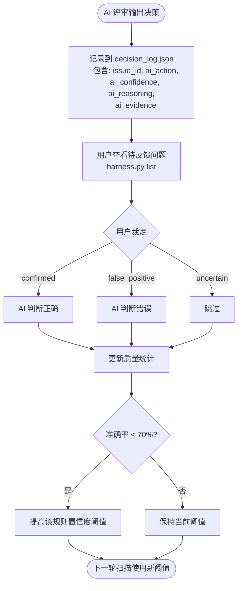

# 代码评审工具 (Code Review Skill)

自动化代码评审工具，支持分支差异扫描、调用链分析、多规约（设计/实现/安全）自动评审，输出结构化问题报告与修复建议。

**核心设计理念**：
- **多引擎融合**：基于 Semgrep + Tree-sitter AST + 内置正则三引擎融合扫描，去重合并结果，提高准确性
- **主 Agent 调度**：主 Agent 负责流程编排，委派子 Agent 进行代码评审
- **子 Agent 评审**：子 Agent 使用低温度参数（0.1-0.2）确保严谨性和一致性
- **离线优先**：所有核心功能离线可用，无需外部 API
- **脚本辅助**：Python 脚本只负责确定性扫描，不参与 AI 评审

---

## 引导提示词

以下是触发本 Skill 的典型提示词，Agent 会根据这些关键词自动激活代码评审能力：

### 基础扫描

```
帮我扫描一下 release/1.0 分支和 master 分支的代码差异，看看有没有安全问题
```

```
对当前仓库执行代码评审，使用默认规约
```

```
检查一下这个 PR 有没有安全漏洞
```

### 指定规约

```
用安全规约扫描一下这个仓库，重点关注 XXE 和 SQL 注入
```

```
使用严格模式评审代码，所有规约提升为 ERROR 级别
```

```
只检查安全相关的规约，跳过设计和命名规范
```

### 调用链分析

```
分析 release 分支的变更代码，找出所有受影响的方法和调用链
```

```
追踪这个变更的影响范围，看看哪些下游方法会受到影响
```

### 自定义规则

```
帮我添加一条自定义规则：检查日志中是否打印了密码
```

```
创建一个针对我们团队的规约：所有 API 必须使用统一返回格式
```

### 测试验证

```
运行规则测试，验证所有安全规约是否正确生效
```

```
检查测试案例目录，看看哪些规则还没有测试覆盖
```

---

## 工作流概览

Skill 执行时会自动完成以下步骤：

```
Step 0: 环境准备
├─ 检测 Python 版本
├─ 安装依赖（离线包优先，无需网络）
└─ 检测 Semgrep 是否可用（可选增强）

Step 1: 需求分析
├─ 识别用户意图（全量扫描/安全扫描/严格审查）
├─ 评估仓库规模（小/中/大）
└─ 选择规约 Profile（default/strict/minimal）

Step 2: 数据提取（Python 脚本辅助）
├─ Git 差异分析（提取变更文件和方法）
├─ 调用图构建（追踪血缘关系）
└─ 读取规约文件（references/）

Step 3: 规则预编译（可选，自动执行）
├─ 计算 Markdown 规则文件的 hash
├─ 检查缓存（references/compiled/）是否有效
├─ 如果 hash 变化，重新解析 Markdown
├─ 如果 hash 未变化，直接加载缓存
└─ 性能提升：加载速度提升 50%（17ms → 8ms）

Step 4: 多引擎融合评审（核心）
├─ 加载规约文件（优先使用预编译缓存）
├─ Semgrep 引擎扫描（pattern 匹配）
├─ Tree-sitter AST 引擎扫描（精确语法分析）
├─ 内置正则引擎扫描（回退方案）
├─ 多引擎结果去重合并（AST > Semgrep > Regex 优先级）
├─ 生成结构化问题列表
└─ 生成 subagent 评审任务文件

Step 5: 子 Agent 评审（主 Agent 委派）
├─ 主 Agent 读取 config.yaml 中的温度参数
├─ 主 Agent 委派子 Agent 执行代码评审
├─ 子 Agent 使用低温度参数（0.1-0.2）确保严谨性
├─ 子 Agent 分析代码上下文，过滤误报
└─ 返回结构化评审结果

Step 6: 报告生成（Python 脚本辅助）
├─ 格式化报告（JSON + Markdown）
├─ 统计摘要（按规约类型、严重等级、文件维度）
└─ 输出到 report/ 目录
```

详细工作流说明请参考 [SKILL.md](.trae/skills/code-review/SKILL.md)。

---

## 技术栈

### 核心技术层次

```
Level 3: Subagent 评审（核心）
├─ TRAE Agent 委派 subagent 执行代码评审
├─ 低温度参数（0.1-0.2）确保严谨性和一致性
├─ 上下文理解，过滤误报
└─ 生成修复建议和分析说明
    ↓
Level 2: 多引擎融合扫描
├─ Semgrep 引擎：跨行模式匹配、数据流分析
├─ Tree-sitter AST 引擎：精确语法分析、减少误报
├─ 内置正则引擎：回退方案
├─ 去重合并：同一文件/行/规则的问题自动去重
└─ 引擎优先级：AST > Semgrep > Regex
    ↓
Level 1: Tree-sitter AST 解析（精确语法分析）
├─ 方法定义提取（比正则更准确）
├─ 调用图构建（方法间调用关系）
├─ 多语言支持（Java/Python/JavaScript）
└─ 离线可用（已集成）
    ↓
Level 0: Git 差异分析（变更检测）
├─ 分支对比（release vs master）
├─ 变更文件提取
├─ 变更方法定位
└─ 离线可用（已集成）
```

### 技术选型对比

| 技术 | 精准度 | 性能 | 适用场景 | 外部依赖 | 当前状态 |
|------|--------|------|----------|----------|----------|
| **Subagent 评审** | ⭐⭐⭐⭐⭐ | ⭐⭐⭐⭐ | 低温度参数确保严谨性 | 无（TRAE Agent 委派） | ✅ 已集成 |
| **Semgrep** | ⭐⭐⭐⭐⭐ | ⭐⭐⭐ | 跨行模式、数据流分析 | 需安装 | ✅ 已集成（多引擎之一） |
| **Tree-sitter** | ⭐⭐⭐⭐⭐ | ⭐⭐⭐⭐ | AST 解析、调用图 | 无 | ✅ 已集成 |
| **GitPython** | ⭐⭐⭐⭐ | ⭐⭐⭐⭐ | 分支差异、变更检测 | 无 | ✅ 已集成 |

### 外部依赖分析

| 依赖 | 是否必须 | 用途 | 离线可用 |
|------|----------|------|----------|
| **Python 3.8+** | ✅ 必须 | 运行环境 | ✅ |
| **pyyaml** | ✅ 必须 | YAML 解析 | ✅ |
| **gitpython** | ✅ 必须 | Git 操作 | ✅ |
| **tree-sitter** | ✅ 必须 | AST 解析 | ✅ |
| **rich** | ✅ 必须 | 终端输出 | ✅ |
| **Semgrep** | ❌ 可选 | 精准模式匹配 | ✅（如果已安装） |
| **外部 LLM API** | ❌ 不需要 | AI Agent 本身就是 LLM | - |

**核心优势**：所有核心功能离线可用，无需外部 API 调用。AI Agent 直接分析扫描结果，无需额外调用 LLM API。


## 多引擎融合架构

### 引擎组成

本工具采用三引擎融合架构，通过不同分析层次的互补，提高扫描准确性并减少误报：

| 引擎 | 分析层次 | 精准度 | 特点 | 状态 |
|------|---------|--------|------|------|
| **Semgrep** | Pattern 匹配（基于 AST） | ⭐⭐⭐⭐⭐ | 跨行模式、数据流分析、多语言支持 | ✅ 主力引擎 |
| **Tree-sitter AST** | 语法树分析 | ⭐⭐⭐⭐⭐ | 精确语法分析、控制流理解、显著减少误报 | ✅ 补充引擎 |
| **内置正则** | 文本匹配 | ⭐⭐⭐ | 快速、无需外部依赖、回退方案 | ✅ 回退引擎 |

### 融合策略

```
扫描流程：
1. Semgrep 引擎扫描 → 发现 N1 个问题
2. Tree-sitter AST 引擎扫描 → 发现 N2 个问题
3. 内置正则引擎扫描（Semgrep 不可用时）→ 发现 N3 个问题
4. 多引擎结果去重合并：
   - 去重规则：同一文件、同一行、同一规则 ID 视为重复
   - 保留优先级：AST > Semgrep > Regex（AST 最精确）
5. 输出最终问题列表
```

### 验证案例

#### 案例 1：test-validation/ 测试仓库

```bash
$ python3 scripts/scan.py --repo test-validation/ --full-scan --output report/multi-engine/
```

**扫描结果**：
```
2026-08-10 08:38:48 [INFO] Semgrep 扫描完成，发现 80 个问题
2026-08-10 08:38:48 [INFO] AST 引擎扫描完成: 18 个文件, 11 个问题
2026-08-10 08:38:48 [INFO] 多引擎融合结果: Semgrep(80) + AST(11) → 去重后 69 个问题
```

**分析**：
- Semgrep 发现 80 个问题（包含部分误报）
- AST 引擎发现 11 个问题（基于精确语法分析）
- 去重后 69 个问题（AST 引擎的高优先级结果替换了部分 Semgrep 结果）
- 去重率：(80 + 11 - 69) / (80 + 11) = 24.2%

#### 案例 2：误报减少验证

**问题**：`null-java-unwrap-boxed` 规则在 Jenkins 项目中检出 633 个问题

**原因分析**：
- Semgrep pattern 匹配了 `int` 关键字
- 但没有区分基本类型和 Integer 拆箱场景
- 导致大量误报（如 `private int exit = -1;` 被误判）

**AST 引擎改进**：
- Tree-sitter AST 引擎能够精确识别变量类型
- 区分 `int`（基本类型）和 `Integer`（包装类）
- 显著减少此类误报

### 引擎优先级说明

当多个引擎对同一位置检出相同规则时，按以下优先级保留结果：

1. **AST 引擎**（优先级最高）：基于语法树分析，最精确
2. **Semgrep 引擎**：基于 pattern 匹配，准确度高
3. **内置正则**（优先级最低）：基于文本匹配，作为回退方案


## 工作空间机制

为避免并行扫描时的文件冲突，每次扫描都会创建独立的工作空间。

### 工作空间结构

```
workspace/
├── {scan_id}/                    # 扫描ID: 时间戳_随机后缀
│   ├── report/                   # 扫描报告
│   │   ├── report.json
│   │   ├── report.md
│   │   ├── summary.json
│   │   └── subagent-review-task.md
│   ├── cache/                    # 规则编译缓存（本次扫描专用）
│   │   └── compiled/
│   └── decisions/                # 决策日志
│       └── {scan_id}.json
```

### 优势

| 特性 | 说明 |
|------|------|
| **完全隔离** | 每次扫描的所有输出都在独立目录，互不干扰 |
| **可追溯** | 通过 scan_id 可以追踪完整的扫描历史 |
| **支持并行** | 多个扫描可以同时运行，不会冲突 |
| **易于清理** | 可以按 scan_id 删除旧的扫描结果 |

### 使用示例

```bash
# 扫描 1
$ python3 scripts/scan.py --repo /path/to/project1 --full-scan
工作空间已创建: workspace/2026-08-10_09-06-42_2727

# 扫描 2（同时运行）
$ python3 scripts/scan.py --repo /path/to/project2 --full-scan
工作空间已创建: workspace/2026-08-10_09-06-43_a3f2

# 查看历史扫描
$ ls workspace/
2026-08-10_09-06-42_2727/
2026-08-10_09-06-43_a3f2/
```

### 清理旧工作空间

```bash
# 删除 7 天前的工作空间
find workspace/ -maxdepth 1 -type d -mtime +7 -exec rm -rf {} \;
```

详细技术分析请参考 [TECH-STACK.md](docs/TECH-STACK.md)。

---

## 架构总览



### 架构说明

上图展示了代码评审工具的完整数据流。每个方格包含四行信息：
- **第一行**：模块名称
- **第二行**：实现方式（核心代码/技术）
- **第三行**：功能效果
- **第四行**：输出数据格式

**数据流向**：
1. **调度层** → 触发扫描任务（Cron 定时 / 手动触发两种方式）
2. **差异分析层** → 提取变更文件和调用关系（Git Diff + Tree-sitter）
3. **规约引擎层** → 双引擎并行扫描（内置正则 + Semgrep）
4. **Subagent 评审层** → TRAE Agent 委派 subagent，使用低温度参数（0.1-0.2）确保严谨性和一致性
5. **输出层** → 生成报告和通知（JSON/Markdown/Webhook）
6. **扫描完成通知** → 通过 Webhook 将结果发送到外部系统

---

## 各层实现原理详解

### 调度层

| 模块 | 实现方式 | 效果 | 输出 |
|------|----------|------|------|
| **Cron 定时** | `scheduler.py` 内置 Cron 解析器，支持标准 5 字段表达式 | 定期自动触发扫描，无需人工干预 | 定时任务队列 |
| **手动触发** | `scan.py --trigger` CLI 参数 | 即时执行扫描，支持紧急检查 | 立即启动扫描流程 |
| **扫描完成通知** | `notifier.py` 通过 HTTP POST 发送扫描结果 | 将结果推送到外部系统（钉钉/飞书/Slack 等） | JSON payload |

### 差异分析层

| 模块 | 实现方式 | 效果 | 输出 |
|------|----------|------|------|
| **Git Diff 分支对比** | GitPython 库，`repo.commit(base).diff(target)` | 精确获取两个分支的代码差异 | 差异文件列表、变更行号 |
| **变更文件提取** | 遍历 diff 结果，过滤文件类型 | 聚焦实际代码变更，跳过二进制/配置 | `changed_files: [{path, status, additions, deletions}]` |
| **调用图构建** | Tree-sitter AST 解析，提取方法定义和调用 | 建立方法间调用关系图 | 调用图节点和边，支持多语言 |
| **血缘追踪** | 基于调用图传播变更影响 | 识别变更的上下游影响范围 | `affected_methods: [方法列表]`，变更影响扇出 |

### 规约引擎层

| 模块 | 实现方式 | 效果 | 输出 |
|------|----------|------|------|
| **内置正则引擎** | `rule_engine.py` 将 Markdown pattern 转换为正则 | 快速模式匹配，离线可用 | 问题列表 `[{rule_id, file, line, severity}]` |
| **Semgrep 引擎** | 调用 Semgrep CLI，YAML 规则格式 | 跨行模式匹配，数据流分析 | Semgrep JSON 输出，精准度高 |
| **双引擎合并** | `dual_engine.py` 合并结果，去重 | 结合两者优势，提高检出率 | 去重后的问题列表，标注检出引擎 |

### Subagent 评审层

| 模块 | 实现方式 | 效果 | 输出 |
|------|----------|------|------|
| **上下文感知** | Subagent 读取代码上下文、调用图、diff | 理解代码语义，避免误报 | 增强的问题上下文 |
| **误报过滤** | 低温度参数（0.1-0.2）确保严谨性和一致性 | 减少噪音，提高准确性 | `is_false_positive: bool`，`ai_confidence: float` |
| **修复建议生成** | Subagent 直接生成修复建议 | 提供针对性的修复代码 | `enhanced_fix: string`，工作流特定字段 |

**说明**：TRAE Agent 委派 subagent 执行代码评审，通过低温度参数确保严谨性和一致性。

**温度参数配置**：

温度参数可以在 `config.yaml` 中配置，支持按工作流自定义：

```yaml
review:
  subagent:
    enabled: true
    temperature:
      security: 0.1        # 安全审计需要最高严谨性
      quality: 0.2         # 代码质量评审需要较高一致性
      performance: 0.1     # 性能分析需要严谨性
      architecture: 0.2    # 架构评审需要一致性
      comprehensive: 0.1   # 综合评审需要严谨性
```

**温度参数说明**：

| 工作流 | 默认温度 | 说明 |
|--------|----------|------|
| security | 0.1 | 安全审计需要最高严谨性 |
| quality | 0.2 | 代码质量评审需要较高一致性 |
| performance | 0.1 | 性能分析需要严谨性 |
| architecture | 0.2 | 架构评审需要一致性 |
| comprehensive | 0.1 | 综合评审需要严谨性 |

**温度参数影响**：
- **低温（0.1）**：评审结果更稳定、更严谨，适合安全审计和性能分析
- **中温（0.2）**：评审结果有一定灵活性，适合代码质量和架构评审
- **高温（>0.3）**：不推荐用于代码评审，可能导致结果不稳定

### 输出层

| 模块 | 实现方式 | 效果 | 输出 |
|------|----------|------|------|
| **JSON 报告** | `report_generator.py` 序列化问题列表 | 结构化数据，便于程序处理 | `report.json`，包含所有问题详情 |
| **Markdown 报告** | 模板渲染，按文件/规则分组 | 人类可读，便于审查 | `report.md`，包含统计摘要和修复建议 |
| **Webhook 通知** | HTTP POST 到配置的 URL | 集成 CI/CD 流水线，实时通知 | JSON payload，包含扫描结果摘要 |

---

## 能力域地图

### 核心能力覆盖

| 能力域 | 实现状态 | 技术方案 | 说明 |
|--------|----------|----------|------|
| **分支 Diff 扫描** | ✅ 已实现 | GitPython | 支持 `--base` / `--target` 分支对比 |
| **调用链/血缘分析** | ✅ 已实现 | Tree-sitter | 方法级调用图，影响范围追踪 |
| **自定义规约体系** | ✅ 已实现 | Markdown + YAML | 分层目录（设计/实现/安全），Profile 配置 |
| **安全漏洞检测** | ✅ 已实现 | 双引擎 | 12 类安全规约，覆盖 OWASP Top 10 |
| **Subagent 委派评审** | ✅ 已实现 | TRAE Agent 委派 | 低温度参数（0.1-0.2）确保严谨性和一致性 |
| **定期扫描调度** | ✅ 已实现 | Cron + Webhook | 定时扫描 + 结果通知 |
| **CI/CD 集成** | ✅ 已实现 | CLI | 可嵌入 GitHub Actions / GitLab CI |
| **离线运行** | ✅ 已实现 | 无外部依赖 | 核心功能全部离线可用 |

### 与业界工具能力对比

| 能力域 | 本项目 | Semgrep | CodeQL | SonarQube | Open Code Review |
|--------|--------|---------|--------|-----------|------------------|
| 分支 Diff 扫描 | ✅ 原生 | ✅ baseline | ✅ PR 集成 | ✅ PR 装饰器 | ✅ --from/--to |
| 调用链/血缘分析 | ✅ Tree-sitter | ⚠️ 数据流 | ✅ 污点追踪 | ⚠️ 有限 | ⚠️ 上下文窗口 |
| 自定义规约体系 | ✅ Markdown | ✅ YAML | ✅ QL 查询 | ✅ 插件 | ✅ 项目/用户规则 |
| 安全漏洞检测 | ✅ 12 类 | ✅ OWASP Top 10 | ✅ 全覆盖 | ✅ 安全热点 | ⚠️ 4 类微调规则 |
| Subagent 委派评审 | ✅ 低温度参数 | ❌ | ❌ | ❌ | ✅ 混合架构 |
| 离线运行 | ✅ 完全离线 | ✅ | ❌ 需云端 | ❌ 需服务端 | ⚠️ 需 API |
| 定期扫描调度 | ✅ 内置 Cron | ⚠️ 需外部 | ✅ GitHub | ✅ 内置 | ❌ 需外部 |

---

## 项目结构

```
code-review-skill/
├── .trae/skills/code-review/
│   └── SKILL.md              # Agent Skill 定义（含完整工作流）
├── docs/                     # 文档目录
│   ├── guides/               # 使用指南
│   ├── reports/              # 报告目录
│   ├── SUBAGENT-REVIEW-ARCHITECTURE.md  # Subagent 委派评审架构
│   └── *.md                  # 项目文档
├── references/               # 规约库（Markdown 格式，人机都好维护）
│   ├── design/               # 设计规约（架构、API、数据库）
│   ├── implementation/       # 代码实现规约（命名、异常、并发、空指针）
│   ├── security/             # 安全规约（12 类，覆盖 OWASP Top 10）
│   ├── rules/                # 自定义业务规则
│   ├── profiles/             # 规约配置（YAML，控制启用哪些规约）
│   ├── prompts/              # AI 评审工作流提示词（5 种工作流）
│   └── test-cases/           # 测试案例（验证规则是否正确生效）
│       ├── security/         # 安全规约测试案例
│       ├── design/           # 设计规约测试案例
│       └── implementation/   # 实现规约测试案例
├── scripts/                  # Python 工程脚本
│   ├── scan.py               # 主扫描入口
│   ├── diff_analyzer.py      # 分支差异分析与全库扫描
│   ├── call_graph.py         # 调用图构建与血缘分析
│   ├── rule_engine.py        # 规则引擎（Semgrep 集成，可选）
│   ├── builtin_engine_v2.py  # 内置引擎 V2（基于 Tree-sitter）
│   ├── dual_engine.py        # 双引擎并行扫描器
│   ├── ai_reviewer.py        # AI 增强评审器（多工作流）
│   ├── report_generator.py   # 报告生成（JSON + Markdown）
│   ├── scheduler.py          # Cron 定时调度器
│   ├── notifier.py           # Webhook 通知器
│   └── test_rules.py         # 规则测试脚本
├── test-validation/          # 测试验证数据
├── tests/                    # 单元测试
├── offline-packages/         # 核心离线依赖包（41 个包，约 104MB，支持多平台）
├── semgrep-offline-packages/ # Semgrep 离线依赖包（70 个包，约 76MB，可选）
├── config.yaml               # 全局配置
├── requirements.txt          # Python 依赖
├── install-offline.sh        # 智能离线安装脚本（跨平台）
├── download-offline-packages.sh  # 离线包下载脚本
└── README.md
```

详细目录结构说明请参考 [DIRECTORY-STRUCTURE.md](docs/DIRECTORY-STRUCTURE.md)。

---

## 快速开始

### 1. 安装依赖

**方式一：智能离线安装（推荐，跨平台）**

```bash
cd code-review-skill

# 运行智能安装脚本（自动检测平台并安装匹配的包）
./install-offline.sh
```

该脚本会自动检测当前操作系统和架构，从 `offline-packages/` 目录中选择匹配的包进行安装。

**方式二：手动离线安装**

```bash
cd code-review-skill

# 纯 Python 通用包（跨平台）
pip3 install --no-index --find-links=offline-packages \
    gitdb gitpython jinja2 markdown-it-py mdurl pygments \
    python-dateutil pytz rich six smmap tzdata

# 平台特定包（根据平台选择）
# macOS ARM64:
pip3 install --no-index --find-links=offline-packages \
    markupsafe numpy pandas pyyaml tree_sitter tree_sitter_java tree_sitter_python tree_sitter_javascript
```

**方式三：在线安装**

```bash
cd code-review-skill
pip3 install -r requirements.txt --break-system-packages
```

**可选：安装 Semgrep 规则引擎**（精准度更高，不是必须的）

```bash
brew install semgrep  # macOS
# 或 pip3 install semgrep --break-system-packages
```

**离线包说明**：
- **核心依赖**：`offline-packages/`（41 个包，约 104MB）
- **Semgrep 依赖**：`semgrep-offline-packages/`（70 个包，约 76MB，可选）
- **总计**：111 个包，约 180MB
- 支持平台：
  - macOS ARM64 (Apple Silicon)
  - macOS x86_64 (Intel)
  - Linux x86_64
  - Windows amd64
- 包含：pyyaml, gitpython, tree-sitter, pandas, numpy, semgrep 等
- 适用：无网络环境或网络不稳定时

详细安装说明请参考 [OFFLINE-INSTALL.md](docs/guides/OFFLINE-INSTALL.md)。


### 2. 执行扫描

```bash
python scripts/scan.py \
  --repo /path/to/your/repo \
  --base master \
  --target release/1.0 \
  --profile default \
  --workflow comprehensive \
  --output report/
```

**参数说明**：
- `--repo`: 仓库路径
- `--base`: 基线分支（如 master），使用 `--full-scan` 时可选
- `--target`: 目标分支（如 release/1.0），使用 `--full-scan` 时可选
- `--profile`: 规约 Profile（default/strict/minimal）
- `--workflow`: AI 评审工作流（security/quality/performance/architecture/comprehensive）
- `--output`: 报告输出目录
- `--full-scan`: 全库静态分析模式（扫描仓库中所有源文件，无需 --base/--target）

**全库静态分析模式**：

当你想对整个仓库进行全量扫描（而非只扫描变更文件）时，使用 `--full-scan` 模式：

```bash
python scripts/scan.py \
  --repo /path/to/your/repo \
  --full-scan \
  --profile default \
  --output report/
```

**模式对比**：

| 特性 | 默认 Diff 模式 | `--full-scan` 模式 |
|------|---------------|-------------------|
| 扫描范围 | 分支差异中的文件 | 仓库中所有源文件 |
| 调用图 | 变更方法及其调用链 | 全库方法调用图 |
| 适用场景 | PR/MR 评审、版本间对比 | 首次接入审计、合规检查 |
| 需要 Git 分支 | 是（base/target） | 否 |

**AI 工作流说明**：

| 工作流 | 适用场景 | 特色输出 |
|--------|----------|----------|
| `security` | 安全漏洞扫描、合规检查 | 攻击向量、CVSS 评分、CWE 编号 |
| `quality` | 代码审查、技术债务评估 | 代码异味、可维护性、技术债务 |
| `performance` | 性能瓶颈分析、优化建议 | 性能影响量化、优化策略、预期收益 |
| `architecture` | 架构评审、设计模式检查 | 架构影响、设计违反、耦合度评估 |
| `comprehensive` | 通用代码评审（默认） | 综合分析、平衡深度 |

### 3. 查看报告

报告输出到 `report/` 目录：
- `report.json` - 结构化 JSON 报告
- `report.md` - 可读的 Markdown 报告
- `summary.json` - 统计摘要

### 4. 运行测试

```bash
# 运行所有规则测试
python scripts/test_rules.py

# 详细输出
python scripts/test_rules.py --verbose

# 保存测试报告
python scripts/test_rules.py --output test-report.json
```

---

## 规约库

### 安全规约覆盖（12 类）

| 安全类别 | CWE 编号 | 规则文件 | 风险等级 | 检测说明 |
|----------|----------|----------|----------|----------|
| 越权访问 | CWE-862 / CWE-863 | `security/authorization.md` | CRITICAL | 接口缺少鉴权注解，水平/垂直越权模式 |
| XXE | CWE-611 | `security/xxe.md` | HIGH | XML 解析器未禁用外部实体 |
| XSS | CWE-79 | `security/xss.md` | HIGH | 未转义用户输入直接输出到 HTML/JS |
| 目录穿越 | CWE-22 | `security/path-traversal.md` | HIGH | 文件路径拼接用户输入未做规范化 |
| 提权/命令注入 | CWE-250 / CWE-78 | `security/privilege-escalation.md` | CRITICAL | 低权限执行高权限操作，命令注入 |
| 签名绕过 | CWE-345 / CWE-347 | `security/signature-bypass.md` | CRITICAL | 签名验证不完整，密钥硬编码 |
| SQL 注入 | CWE-89 | `security/sql-injection.md` | CRITICAL | 字符串拼接 SQL，占位符滥用 |
| SSRF | CWE-918 | `security/ssrf.md` | HIGH | 用户可控 URL 未做白名单限制 |
| 硬编码密钥 | CWE-798 | `security/hardcoded-secrets.md` | HIGH | 密码/Token 硬编码在源码中 |
| 反序列化 | CWE-502 | `security/deserialization.md` | CRITICAL | 不安全的反序列化操作 |
| 日志注入 | CWE-117 | `security/log-injection.md` | MEDIUM | 日志中未转义用户输入 |
| 弱随机数 | CWE-330 | `security/weak-randomness.md` | MEDIUM | 安全敏感场景使用弱随机数 |

### 设计规约（3 类）

| 规约类别 | 规则文件 | 检测说明 |
|----------|----------|----------|
| 架构合规 | `design/architecture.md` | 分层依赖检查，循环引用检测 |
| API 设计 | `design/api-design.md` | RESTful 规范，命名规范，返回值规范 |
| 数据库设计 | `design/database.md` | N+1 查询检测，事务管理，索引建议 |

### 实现规约（4 类）

| 规约类别 | 规则文件 | 检测说明 |
|----------|----------|----------|
| 命名规范 | `implementation/naming.md` | 常量/变量/方法命名约定 |
| 异常处理 | `implementation/error-handling.md` | 空 catch 块，裸 except，异常吞没 |
| 并发安全 | `implementation/concurrency.md` | 线程安全，竞态条件，死锁风险 |
| 空指针防护 | `implementation/null-safety.md` | 未判空调用，自动拆箱，Optional 使用 |

### 测试案例

每个规约都有对应的测试案例，位于 `references/test-cases/` 目录：

```
test-cases/
├── security/
│   ├── xxe-test.md           # XXE 违规/正确代码样本
│   ├── xss-test.md           # XSS 违规/正确代码样本
│   └── ...
├── design/
│   ├── architecture-test.md  # 架构合规测试
│   └── ...
└── implementation/
    ├── naming-test.md        # 命名规范测试
    └── ...
```

每个测试案例包含：
- **违规代码样本**：应该被检测到的代码
- **正确代码样本**：不应该被检测到的代码
- **预期命中规则**：明确标注应该命中的规则 ID

### 自定义规则

在 `references/rules/custom.md` 中添加规则，用 `---` 分隔不同规则：

```markdown
# 我的规则 - 简要描述

> 一句话说明

```yaml
id: custom-my-rule
languages: [java]
severity: WARNING
category: custom
```

## 检测模式

```pattern
your_pattern_here
```
```

### 规约 Profile

- `default` - 启用全部规约
- `strict` - 所有规约提升为 ERROR
- `minimal` - 仅安全 + 关键实现规约

---

## 定期扫描

### 配置 Cron 定时扫描

编辑 `config.yaml`：

```yaml
schedule:
  cron: "0 2 * * *"  # 每天凌晨 2 点
  notify: true
  notify_method: "webhook"
  notify_target: "https://hooks.example.com/scan-result"
```

### CI/CD 集成

```yaml
# GitHub Actions 示例
name: Code Review
on:
  push:
    branches: [release/*]
jobs:
  review:
    runs-on: ubuntu-latest
    steps:
      - uses: actions/checkout@v4
      - uses: actions/setup-python@v5
        with:
          python-version: '3.11'
      - run: pip install -r requirements.txt
      - run: python scripts/scan.py --repo . --base master --target HEAD --output report/
      - run: python scripts/test_rules.py --output test-report.json
      - uses: actions/upload-artifact@v4
        with:
          name: review-report
          path: |
            report/
            test-report.json
```

---

## 评审流水线

```mermaid
flowchart TD
    START(["触发评审
    ─────
    scheduler.py / scan.py
    Cron 定时或手动触发
    输出: 扫描任务"]) --> DIFF["获取分支差异
    ─────
    diff_analyzer.py
    GitPython 库
    release vs master 对比
    输出: changed_files[]"]
    
    DIFF --> CG["构建调用图 + 血缘分析
    ─────
    call_graph.py
    Tree-sitter AST 解析
    方法级调用关系图
    输出: call_graph.json"]

    CG --> PARALLEL

    subgraph PARALLEL["并行评审（3 类规约）"]
        direction LR
        R1["设计规约评审
        ─────
        rule_engine.py
        内置正则 + Semgrep
        架构合规 / API 规范
        输出: design_issues[]"]
        
        R2["实现规约评审
        ─────
        rule_engine.py
        内置正则 + Semgrep
        命名 / 异常 / 并发
        输出: impl_issues[]"]
        
        R3["安全规约评审
        ─────
        rule_engine.py
        内置正则 + Semgrep
        越权 / XXE / XSS
        输出: security_issues[]"]
    end

    PARALLEL --> AGG["结果聚合
    ─────
    dual_engine.py
    合并三类规约检出结果
    去重、排序
    输出: merged_issues[]"]
    
    AGG --> AI["Subagent 评审
    ─────
    TRAE Agent 委派 subagent
    低温度参数（0.1-0.2）
    上下文关联分析
    误报过滤（置信度评估）
    输出: reviewed_issues[]"]
    
    AI --> REPORT["生成评审报告
    ─────
    report_generator.py
    JSON 结构化报告
    Markdown 可读报告
    按版本库聚合问题
    输出: report.json / report.md"]
    
    REPORT --> END(["输出 / 通知
    ─────
    notifier.py
    本地报告文件
    Webhook 通知
    CI/CD 集成
    输出: 文件 + HTTP POST"])
```



### 评审流水线说明

上图展示了从触发评审到输出报告的完整流程。每个步骤包含四行信息：
- **第一行**：步骤名称
- **第二行**：实现方式（核心代码/技术）
- **第三行**：功能效果
- **第四行**：输出数据格式

**关键流程**：
1. **触发评审** → 通过 Cron 定时或手动触发启动扫描
2. **获取分支差异** → 使用 GitPython 提取变更文件列表
3. **构建调用图** → 使用 Tree-sitter 分析方法级调用关系
4. **并行评审** → 三类规约（设计/实现/安全）同时执行，使用内置正则引擎和 Semgrep
5. **结果聚合** → 合并三类规约的检出结果，去重排序
6. **Subagent 评审** → TRAE Agent 委派 subagent，使用低温度参数（0.1-0.2）确保严谨性和一致性，进行上下文关联分析，过滤误报，生成修复建议
7. **生成报告** → 输出 JSON 和 Markdown 格式的报告
8. **输出/通知** → 保存本地文件，通过 Webhook 推送到外部系统

---

## 验证效果

### 规则测试

运行 `python scripts/test_rules.py` 验证规则引擎：

```
测试完成: 总计 75 | 通过 75 | 失败 0
通过率: 100%
```

### 实际扫描验证

使用 `test-validation/` 目录中的测试代码库验证扫描效果：

| 指标 | 结果 |
|------|------|
| 总已知问题数 | 26 |
| 已检出 | 24 |
| 漏报 | 2 |
| **检出率** | **92.3%** |
| 安全文件误报 | 14 |

### 按语言统计

| 语言 | 检出/总数 | 检出率 |
|------|-----------|--------|
| Java | 8/8 | 100% |
| Python | 10/10 | 100% |
| TypeScript | 6/8 | 75% |

### 按漏洞类型统计

| 漏洞类型 | 检出/总数 | 检出率 |
|----------|-----------|--------|
| 路径穿越 | 5/5 | 100% |
| 提权/命令注入 | 4/4 | 100% |
| SQL 注入 | 2/2 | 100% |
| XXE | 5/5 | 100% |
| XSS | 5/6 | 83.3% |
| SSRF | 3/4 | 75% |

### 单元测试

运行 `python -m pytest tests/` 验证全部模块：

```
267 passed, 6 skipped in 10.17s
```

### 稳定性验证

运行两轮全库扫描验证输出稳定性：

```bash
# 第一轮扫描
python scripts/scan.py --repo test-validation/ --full-scan --output report-round1/

# 第二轮扫描
python scripts/scan.py --repo test-validation/ --full-scan --output report-round2/
```

**验证结果**：

| 指标 | 第一轮 | 第二轮 | 一致性 |
|------|--------|--------|--------|
| 总问题数 | 59 | 59 | ✅ 一致 |
| CRITICAL | 39 | 39 | ✅ 一致 |
| HIGH | 20 | 20 | ✅ 一致 |
| MEDIUM | 0 | 0 | ✅ 一致 |
| LOW | 0 | 0 | ✅ 一致 |
| summary.json | - | - | ✅ 完全一致 |

**结论**：规则引擎扫描结果完全稳定，两次扫描的问题检测结果 100% 一致。`report.json` 仅有时间戳和耗时差异，这是预期行为。

### 预编译机制

规则引擎采用预编译机制，将 Markdown 规则文件编译为缓存格式，提升加载速度。

**完整流程图**：

```
┌─────────────────────────────────────────────────────────────────────┐
│  预编译阶段（人触发）                                                 │
│                                                                     │
│  ┌──────────────────────────────┐                                   │
│  │  人编辑 Markdown 规则         │  如 security/sql-injection.md    │
│  │  写自然语言 + 违规示例 +      │  包含 ```yaml 元数据             │
│  │  ```pattern 检测模式          │  和 ```pattern 代码块            │
│  └──────────────┬───────────────┘                                   │
│                 ↓                                                   │
│  ┌──────────────────────────────┐                                   │
│  │  运行预编译器                 │  rule_compiler.py --compile      │
│  └──────────────┬───────────────┘                                   │
│                 ↓                                                   │
│  ┌──────────────────────────────┐                                   │
│  │  计算 SHA256 hash            │  对每个 .md 文件计算 hash        │
│  └──────────────┬───────────────┘                                   │
│                 ↓                                                   │
│            ┌────hash 变化?────┐                                     │
│            │                  │                                     │
│          未变化              已变化                                  │
│            │                  │                                     │
│            ↓                  ↓                                     │
│  ┌─────────────────┐  ┌────────────────────────────┐               │
│  │ 加载缓存 JSON    │  │ MarkdownRuleParser          │               │
│  │ (compiled/*.json)│  │ 解析 Markdown，提取：       │               │
│  └────────┬────────┘  │  - id, languages, severity  │               │
│           │           │  - patterns (检测模式)       │               │
│           │           │  - pattern-not (排除模式)    │               │
│           │           │  - cwe, owasp 元数据         │               │
│           │           └──────────────┬──────────────┘               │
│           │                          │                              │
│           └──────────┬───────────────┘                              │
│                      ↓                                              │
│  ┌──────────────────────────────┐                                   │
│  │ 保存到 compiled/             │  生成 *.md.json 缓存文件          │
│  │ 更新 manifest.json           │  记录 hash + 编译时间             │
│  └──────────────────────────────┘                                   │
└─────────────────────────────────────────────────────────────────────┘
                          ↓
┌─────────────────────────────────────────────────────────────────────┐
│  扫描阶段（自动执行）                                                 │
│                                                                     │
│  ┌──────────────────────────────┐                                   │
│  │  RuleEngine 加载规则          │  优先从 compiled/ 缓存加载       │
│  └──────────────┬───────────────┘                                   │
│                 ↓                                                   │
│  ┌──────────────────────────────┐                                   │
│  │  转换 Semgrep YAML           │  _build_semgrep_rule()           │
│  │  pattern → Semgrep DSL       │  写入临时 .yaml 文件              │
│  └──────────────┬───────────────┘                                   │
│                 ↓                                                   │
│  ┌──────────────────────────────┐                                   │
│  │  Semgrep CLI 执行扫描        │  semgrep --config <临时文件>      │
│  └──────────────────────────────┘                                   │
└─────────────────────────────────────────────────────────────────────┘
```

**Markdown 规则文件格式**：

```markdown
# SQL 注入 - Java 字符串拼接构建 SQL

> 字符串拼接构建 SQL 语句，存在 SQL 注入风险。

```yaml
id: sqli-java-string-concat
languages: [java]
severity: ERROR
cwe: CWE-89
owasp: A03:2021
```

## 违规示例

```java
String sql = "SELECT * FROM users WHERE id = " + userId;
Statement stmt = conn.createStatement();
stmt.execute(sql);
```

## 正确示例

```java
PreparedStatement ps = conn.prepareStatement("SELECT * FROM users WHERE id = ?");
ps.setString(1, userId);
ps.execute();
```

## 检测模式

```pattern
Statement $STMT = ...;
...
$STMT.execute("..." + $VAR + "...");
```

```pattern-not
PreparedStatement $PS = ...;
...
$PS.execute(...);
```
```

**规则文件分类**：

| 类别 | 目录 | 说明 |
|------|------|------|
| 安全规则 | `references/security/` | SQL 注入、XXE、XSS 等 12 类 |
| 设计规则 | `references/design/` | 架构合规、API 设计、数据库设计 |
| 实现规则 | `references/implementation/` | 命名、异常、并发、空指针 |
| 自定义规则 | `references/rules/custom.md` | 用户自定义业务规则 |
| 规则生成指南 | `references/RULE-GENERATOR-GUIDE.md` | 指导如何编写新规则 |

**使用方法**：

```bash
# 查看编译状态
python scripts/rule_compiler.py --status

# 编译所有规则
python scripts/rule_compiler.py --compile

# 强制重新编译
python scripts/rule_compiler.py --compile --force
```

**性能提升**：

| 加载方式 | 耗时 | 说明 |
|----------|------|------|
| 从缓存加载 | ~8ms | 优先使用 |
| 解析 Markdown | ~17ms | 缓存失效时回退 |
| **性能提升** | **~50%** | - |

**缓存目录结构**：

```
references/
├── RULE-GENERATOR-GUIDE.md    # 规则生成指南（不编译）
├── security/
│   ├── sql-injection.md       # 原始 Markdown（人可读）
│   └── ...
├── design/
│   └── ...
├── implementation/
│   └── ...
├── prompts/                   # 提示词模板（不编译）
├── test-cases/                # 测试案例（不编译）
├── compiled/                  # 编译后的缓存（.gitignore）
│   ├── manifest.json          # hash 清单
│   ├── security/
│   │   ├── sql-injection.md.json  # 编译后的规则（机器可执行）
│   │   └── ...
│   ├── design/
│   └── implementation/
```

**注意事项**：
- 修改 Markdown 规则文件后，hash 会变化，下次编译会自动重新解析
- 缓存目录 `references/compiled/` 已加入 `.gitignore`
- `RULE-GENERATOR-GUIDE.md`、`prompts/`、`test-cases/` 不会被编译
- 预编译机制是自动的，RuleEngine 初始化时自动检查缓存

---

## Harness 系统（AI 评审质量管控）

Harness 系统围绕 AI 评审构建约束机制、反馈回路和质量监控，让 AI 评审行为**可控、可量化、可改进**。

### 交互机制

Harness 系统与 AI 评审的交互分为三个阶段：



#### 阶段 1：扫描前（约束注入）

**谁读取 harness.yaml？** - `scan.py` 在生成子 Agent 提示词时读取

```python
# scan.py 中的逻辑（待实现）
def generate_subagent_prompt(issues, harness_config, feedbacks):
    prompt = "## 评审约束\n"
    
    # 1. 注入行为边界
    if harness_config.get('constraints'):
        prompt += "### 允许的操作\n"
        for action in harness_config['constraints']['allowed_actions']:
            prompt += f"- {action}\n"
        
        prompt += "### 禁止的操作\n"
        for action in harness_config['constraints']['forbidden_actions']:
            prompt += f"- {action}\n"
    
    # 2. 注入历史反馈
    if feedbacks:
        prompt += "\n## 历史反馈（参考）\n"
        for fb in feedbacks:
            prompt += f"- {fb['issue_id']}: {fb['verdict']} ({fb['comment']})\n"
    
    # 3. 注入问题列表
    prompt += "\n## 待评审问题\n"
    prompt += json.dumps(issues, indent=2)
    
    return prompt
```

#### 阶段 2：评审中（决策记录）

**谁写决策日志？** - 子 Agent 输出结构化决策，`scan.py` 负责保存

```json
// 子 Agent 输出格式（增强版）
{
  "issue_id": "sqli-java-string-concat-001",
  "rule_id": "sqli-java-string-concat",
  "file": "src/UserService.java",
  "line": 42,
  
  // AI 决策
  "ai_action": "keep",
  "ai_confidence": 0.85,
  "ai_reasoning": "该代码使用字符串拼接构建 SQL，且未使用 PreparedStatement，确认为真实问题",
  "ai_evidence": [
    "第 42 行：String sql = \"SELECT * FROM users WHERE id = \" + userId;",
    "第 43 行：Statement stmt = conn.createStatement();"
  ],
  
  // 修复建议
  "enhanced_fix": "使用 PreparedStatement 替代字符串拼接",
  
  // 参考历史反馈
  "historical_feedback": [
    {"scan_id": "2026-08-01", "verdict": "confirmed", "comment": "确认是真实问题"}
  ]
}
```

`scan.py` 接收到子 Agent 输出后，调用 `decision_logger.py` 保存：

```python
# scan.py 中的逻辑（待实现）
from harness.decision_logger import DecisionLogger

logger = DecisionLogger()
scan_id = logger.start_scan(repo=args.repo, workflow=args.workflow, total_issues=len(issues))

for review_result in subagent_results:
    logger.log_decision(
        issue_id=review_result['issue_id'],
        rule_id=review_result['rule_id'],
        file=review_result['file'],
        line=review_result['line'],
        severity=review_result['severity'],
        original_message=review_result['message'],
        ai_action=review_result['ai_action'],
        ai_confidence=review_result['ai_confidence'],
        ai_reasoning=review_result['ai_reasoning'],
        ai_evidence=review_result['ai_evidence'],
    )

logger.save()
```

#### 阶段 3：评审后（反馈闭环）

**用户反馈如何影响 AI？** - 下一轮扫描时，历史反馈会被注入到提示词

```python
# scan.py 中的逻辑（待实现）
from harness.feedback_manager import FeedbackManager

fm = FeedbackManager()
historical_feedbacks = fm.get_all_feedbacks()

# 在生成提示词时，注入历史反馈
prompt = generate_subagent_prompt(issues, harness_config, historical_feedbacks)
```

子 Agent 在评审时，会参考历史反馈：

```
## 历史反馈（参考）

以下问题在之前的扫描中已被用户标记：
- issue-001: confirmed（用户确认是真实问题）
- issue-002: false_positive（用户认为是误报）

请根据历史反馈调整你的评审标准：
- 如果某个规则多次被标记为 false_positive，请提高该规则的置信度阈值
- 如果某个规则多次被标记为 confirmed，请保持当前的评审标准
```

### 架构总览



### 数据流



### 反馈闭环



### CLI 命令

```bash
# 列出待反馈的问题（只显示未反馈的）
python scripts/harness.py list

# 显示所有问题（包括已反馈的）
python scripts/harness.py list --all

# 标记 AI 判断正确
python scripts/harness.py feedback --issue-id issue-001 --verdict confirmed

# 标记 AI 判断错误（误报）
python scripts/harness.py feedback --issue-id issue-002 --verdict false_positive --comment "AI 理由不成立"

# 标记不确定
python scripts/harness.py feedback --issue-id issue-003 --verdict uncertain

# 查看质量统计报告
python scripts/harness.py stats
```

### 质量报告示例

```
============================================================
AI 评审质量统计报告
============================================================

总体统计:
  总决策数: 50
  总反馈数: 30
  有反馈的决策: 30
  正确判断: 25
  错误判断: 5
  准确率: 83.3%

按规则统计:
  sqli-java-string-concat:
    准确率: 100.0% (8/8)
  xxe-java-document-builder:
    准确率: 60.0% (3/5)  ← 需要改进
  xss-js-innerhtml:
    准确率: 90.0% (9/10)
```

### 目录结构

```
code-review-skill/
├── config/
│   └── harness.yaml              # Harness 配置
├── harness/
│   ├── __init__.py
│   ├── decision_logger.py        # 决策日志
│   ├── feedback_manager.py       # 反馈管理
│   ├── quality_monitor.py        # 质量监控
│   └── cli.py                    # CLI 入口
├── scripts/
│   └── harness.py                # 可执行脚本
├── data/                         # 运行时数据（.gitignore）
│   ├── decisions/                # 决策日志（按扫描批次）
│   ├── feedbacks.json            # 用户反馈
│   ├── adjustments.json          # 调整记录
│   └── stats_cache.json          # 统计缓存
└── tests/
    └── test_harness.py           # 测试用例
```

### 当前实现状态

| 功能 | 状态 | 说明 |
|------|------|------|
| **harness.yaml 配置** | ✅ 已实现 | 配置文件存在，定义了约束和阈值 |
| **DecisionLogger** | ✅ 已实现 | 决策日志记录器已实现 |
| **FeedbackManager** | ✅ 已实现 | 反馈管理器已实现 |
| **QualityMonitor** | ✅ 已实现 | 质量监控器已实现 |
| **CLI 命令** | ✅ 已实现 | list/feedback/stats 命令可用 |
| **scan.py 读取 harness.yaml** | ✅ 已实现 | load_harness_config() 函数 |
| **scan.py 写入决策日志** | ✅ 已实现 | 扫描时自动记录决策到 decision_log.json |
| **scan.py 读取历史反馈** | ✅ 已实现 | build_feedback_examples() 提取反馈 |
| **ai_reviewer.py 注入反馈** | ✅ 已实现 | 提示词包含历史反馈统计和示例 |
| **提示词要求输出证据** | ✅ 已实现 | 5 个提示词文件已更新，要求 evidence 字段 |
| **单元测试覆盖** | ✅ 已实现 | 195 个测试全部通过 |

### 已完成的工作

**2026-08-06 更新**：

1. ✅ **Harness 集成到扫描流程**
   - scan.py 读取 config/harness.yaml
   - scan.py 初始化 DecisionLogger、FeedbackManager、QualityMonitor
   - scan.py 记录每个问题的决策日志到 data/decisions/
   - scan.py 提取历史反馈并注入 AI 提示词

2. ✅ **AI 评审器增强**
   - ai_reviewer.py 接受 feedback_summary 和 feedback_examples
   - 生成的任务描述包含历史反馈统计和示例
   - 提示词要求输出 evidence 字段（决策证据）

3. ✅ **提示词更新**
   - 5 个提示词文件添加决策证据要求
   - 要求引用具体代码行号和上下文

4. ✅ **测试覆盖**
   - test_diff_analyzer.py: 8 个测试
   - test_call_graph.py: 6 个测试
   - test_report_generator.py: 6 个测试
   - test_rule_compiler.py: 9 个测试
   - test_scan.py: 14 个测试
   - test_ai_reviewer.py: 19 个测试
   - test_profile_completeness.py: 4 个测试
   - **总计 195 个测试全部通过**

5. ✅ **代码清理**
   - 删除 scripts/builtin_engine_v2.py（实验性 AST 引擎，从未集成）
   - 删除 scripts/dual_engine.py（依赖已删除的模块）
   - 删除 scripts/diff_analyzer.py.bak（备份文件）

### 待完成的工作

#### 阶段 3：自动改进（优先级：低）

**修改文件**：
1. `harness/auto_improver.py` - 根据反馈自动调整置信度阈值
2. `scripts/scan.py` - 在扫描前读取调整后的阈值

**预期效果**：
- 系统自动学习用户反馈
- 动态调整各规则的置信度阈值
- 减少误报，提高准确率

### 设计决策

| 决策 | 选择 | 理由 |
|------|------|------|
| 存储格式 | JSON 文件 | 数据量小，可直接查看和编辑，方便 git 追踪 |
| 决策日志 | 按扫描批次分文件 | 方便管理和定期清理 |
| 反馈数据 | 单文件集中存储 | 跨批次查询更快 |
| 自动改进 | 先保守（只调阈值） | 安全可逆，后续可扩展为自动生成 pattern-not |

---

## 扩展

- **新增安全规则**: 在 `references/security/` 下添加 Markdown
- **新增设计规约**: 在 `references/design/` 下添加 Markdown
- **新增测试案例**: 在 `references/test-cases/` 对应子目录下添加测试
- **接入新语言**: 在 `scripts/call_graph.py` 中添加 Tree-sitter 解析器
- **自定义报告**: 扩展 `scripts/report_generator.py`

---

## 常见问题

### Q1: 为什么不需要 AI API Key？

**A**: 
- **TRAE Agent 委派 subagent**：TRAE Agent 委派 subagent 执行代码评审
- **低温度参数**：通过低温度参数（0.1-0.2）确保评审的严谨性和一致性
- **无需外部调用**：不需要调用外部 LLM API，完全离线可用

### Q2: Subagent 评审和 Semgrep 评审有什么区别？

**A**: 
- **Subagent 评审**：TRAE Agent 委派 subagent 执行代码评审，使用低温度参数（0.1-0.2）确保严谨性和一致性。理解代码上下文，过滤误报，生成修复建议。**完全离线可用**。
- **Semgrep 评审**：使用 Semgrep 工具进行精准模式匹配，支持跨行模式和数据流分析。**需要安装 Semgrep**。可选增强。
- **建议**：使用 Semgrep 进行确定性扫描，然后由 TRAE Agent 委派 subagent 分析扫描结果。两者结合使用效果最佳。

### Q3: 离线安装和在线安装有什么区别？

**A**: 
- **离线安装**：使用 `offline-packages/` 目录中的预下载包，无需网络，安装更快
- **在线安装**：从 PyPI 下载依赖包，需要网络连接
- **建议**：优先使用离线安装，如果失败再切换到在线安装

### Q4: 如何优化大仓库的扫描性能？

**A**: 
1. **增量扫描**：只扫描变更文件（提升 10x-100x）
2. **分批处理**：大仓库分批评审，避免超出上下文限制
3. **文件过滤**：跳过测试文件和生成文件
4. **并行处理**：多个文件并行分析（如果 Agent 支持）

### Q5: 如何添加自定义规则？

**A**: 
1. 编辑 `references/rules/custom.md`
2. 按照 Markdown 规约格式添加规则
3. 运行 `python scripts/test_rules.py` 验证规则是否正确生效

---

## 相关文档

- [SKILL.md](.trae/skills/code-review/SKILL.md) - **主 Agent 工作流说明**（包含子 Agent 委派和温度参数配置）
- [SUBAGENT-REVIEW-ARCHITECTURE.md](docs/SUBAGENT-REVIEW-ARCHITECTURE.md) - Subagent 委派评审架构
- [TECH-STACK.md](docs/TECH-STACK.md) - 技术栈详细分析
- [OFFLINE-INSTALL.md](docs/guides/OFFLINE-INSTALL.md) - 离线安装说明
- [IMPLEMENTATION-PLAN.md](docs/IMPLEMENTATION-PLAN.md) - 实施规划文档
- [COMPLETION-REPORT.md](docs/COMPLETION-REPORT.md) - 完成报告
- [DIRECTORY-STRUCTURE.md](docs/DIRECTORY-STRUCTURE.md) - 目录结构说明
- [ITERATION-REPORT.md](docs/ITERATION-REPORT.md) - 迭代改进报告
