# 高级用法

---

## 定期扫描

### 配置 Cron 定时扫描

编辑 `config.yaml`：

```yaml
schedule:
  cron: "0 2 * * *"  # 每天凌晨 2 点
  notify: true
  notify_method: "webhook"
  notify_target: "https://hooks.example.com/scan-result"
```

### CI/CD 集成

```yaml
# GitHub Actions 示例
name: Code Review
on:
  push:
    branches: [release/*]
jobs:
  review:
    runs-on: ubuntu-latest
    steps:
      - uses: actions/checkout@v4
      - uses: actions/setup-python@v5
        with:
          python-version: '3.11'
      - run: pip install -r requirements.txt
      - run: python scripts/scan.py --repo . --base master --target HEAD
      - run: python scripts/test_rules.py --output test-report.json
      - uses: actions/upload-artifact@v4
        with:
          name: review-report
          path: |
            report/
            test-report.json
```

---


---

## 评审流水线

```mermaid
flowchart TD
    START(["触发评审
    ─────
    scheduler.py / scan.py
    Cron 定时或手动触发
    输出: 扫描任务"]) --> DIFF["获取分支差异
    ─────
    diff_analyzer.py
    GitPython 库
    release vs master 对比
    输出: changed_files[]"]
    
    DIFF --> CG["构建调用图 + 血缘分析
    ─────
    call_graph.py
    Tree-sitter AST 解析
    方法级调用关系图
    输出: call_graph.json"]

    CG --> PARALLEL

    subgraph PARALLEL["并行评审（3 类规约）"]
        direction LR
        R1["设计规约评审
        ─────
        rule_engine.py
        内置正则 + Semgrep
        架构合规 / API 规范
        输出: design_issues[]"]
        
        R2["实现规约评审
        ─────
        rule_engine.py
        内置正则 + Semgrep
        命名 / 异常 / 并发
        输出: impl_issues[]"]
        
        R3["安全规约评审
        ─────
        rule_engine.py
        内置正则 + Semgrep
        越权 / XXE / XSS
        输出: security_issues[]"]
    end

    PARALLEL --> AGG["结果聚合
    ─────
    dual_engine.py
    合并三类规约检出结果
    去重、排序
    输出: merged_issues[]"]
    
    AGG --> AI["Subagent 评审
    ─────
    TRAE Agent 委派 subagent
    低温度参数（0.1-0.2）
    上下文关联分析
    误报过滤（置信度评估）
    输出: reviewed_issues[]"]
    
    AI --> REPORT["生成评审报告
    ─────
    report_generator.py
    JSON 结构化报告
    Markdown 可读报告
    按版本库聚合问题
    输出: report.json / report.md"]
    
    REPORT --> END(["输出 / 通知
    ─────
    notifier.py
    本地报告文件
    Webhook 通知
    CI/CD 集成
    输出: 文件 + HTTP POST"])
```



### 评审流水线说明

上图展示了从触发评审到输出报告的完整流程。每个步骤包含四行信息：
- **第一行**：步骤名称
- **第二行**：实现方式（核心代码/技术）
- **第三行**：功能效果
- **第四行**：输出数据格式

**关键流程**：
1. **触发评审** → 通过 Cron 定时或手动触发启动扫描
2. **获取分支差异** → 使用 GitPython 提取变更文件列表
3. **构建调用图** → 使用 Tree-sitter 分析方法级调用关系
4. **并行评审** → 三类规约（设计/实现/安全）同时执行，使用内置正则引擎和 Semgrep
5. **结果聚合** → 合并三类规约的检出结果，去重排序
6. **Subagent 评审** → TRAE Agent 委派 subagent，使用低温度参数（0.1-0.2）确保严谨性和一致性，进行上下文关联分析，过滤误报，生成修复建议
7. **生成报告** → 输出 JSON 和 Markdown 格式的报告
8. **输出/通知** → 保存本地文件，通过 Webhook 推送到外部系统

---


---

## 扩展

- **新增安全规则**: 在 `references/security/` 下添加 Markdown
- **新增设计规约**: 在 `references/design/` 下添加 Markdown
- **新增测试案例**: 在 `references/test-cases/` 对应子目录下添加测试
- **接入新语言**: 在 `scripts/call_graph.py` 中添加 Tree-sitter 解析器
- **自定义报告**: 扩展 `scripts/report_generator.py`

---


