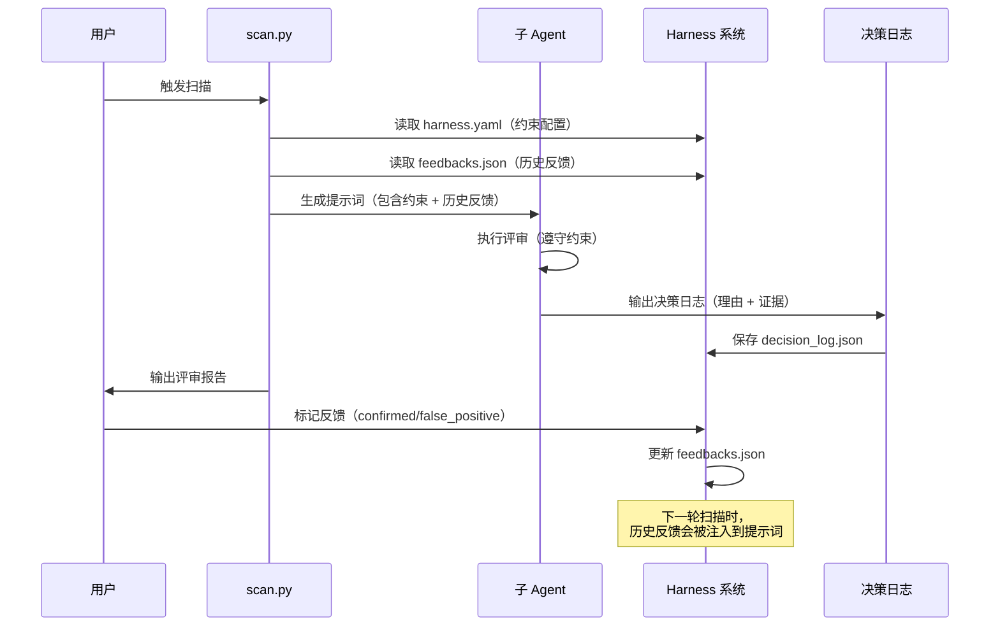
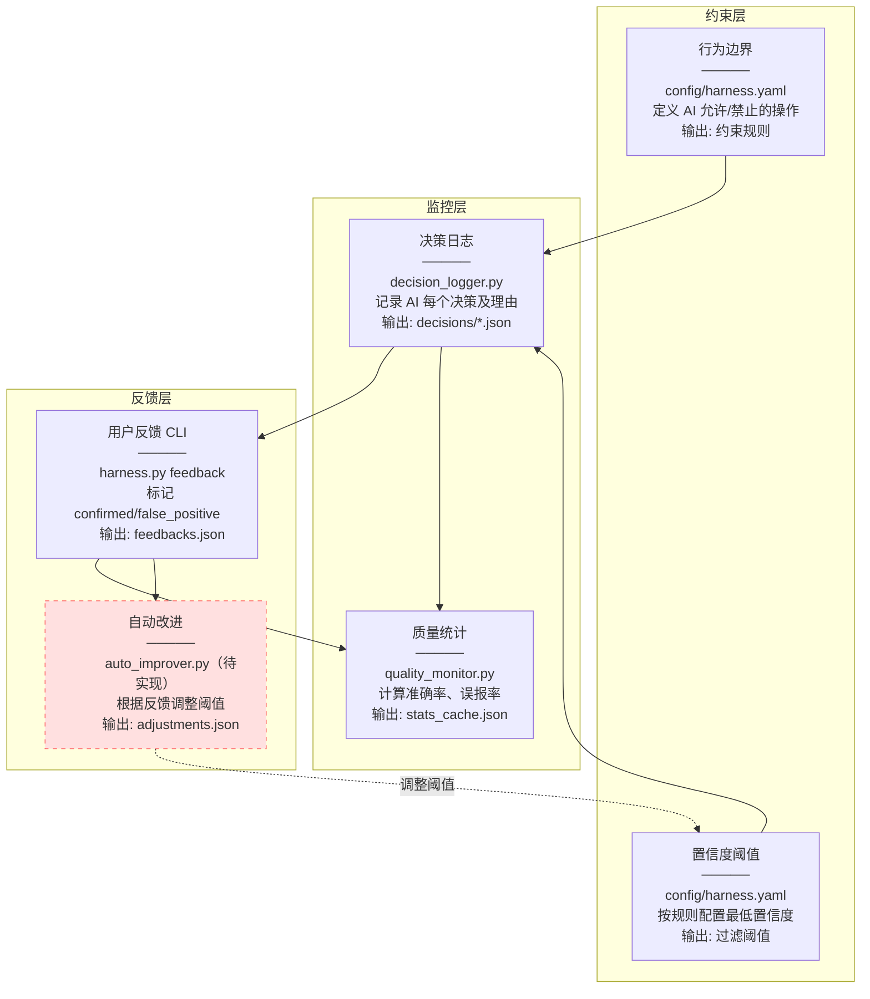
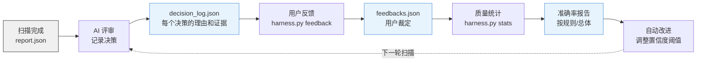
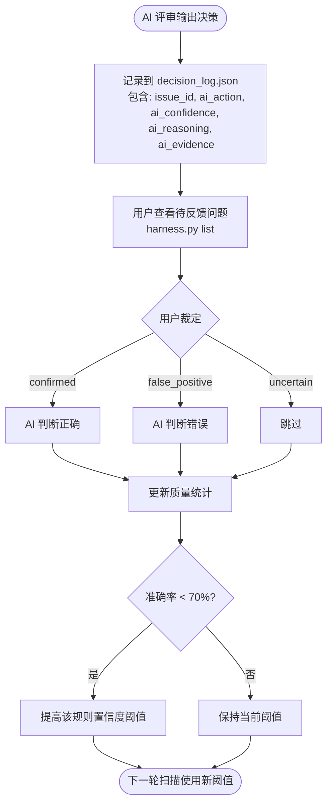

# AI 评审机制

---

## Harness 系统（AI 评审质量管控）

Harness 系统围绕 AI 评审构建约束机制、反馈回路和质量监控，让 AI 评审行为**可控、可量化、可改进**。

### 交互机制

Harness 系统与 AI 评审的交互分为三个阶段：



#### 阶段 1：扫描前（约束注入）

**谁读取 harness.yaml？** - `scan.py` 在生成子 Agent 提示词时读取

```python
# scan.py 中的逻辑（示意代码，实际实现见 scan.py）
def generate_subagent_prompt(issues, harness_config, feedbacks):
    prompt = "## 评审约束\n"
    
    # 1. 注入行为边界
    if harness_config.get('constraints'):
        prompt += "### 允许的操作\n"
        for action in harness_config['constraints']['allowed_actions']:
            prompt += f"- {action}\n"
        
        prompt += "### 禁止的操作\n"
        for action in harness_config['constraints']['forbidden_actions']:
            prompt += f"- {action}\n"
    
    # 2. 注入历史反馈
    if feedbacks:
        prompt += "\n## 历史反馈（参考）\n"
        for fb in feedbacks:
            prompt += f"- {fb['issue_id']}: {fb['verdict']} ({fb['comment']})\n"
    
    # 3. 注入问题列表
    prompt += "\n## 待评审问题\n"
    prompt += json.dumps(issues, indent=2)
    
    return prompt
```

#### 阶段 2：评审中（决策记录）

**谁写决策日志？** - 子 Agent 输出结构化决策，`scan.py` 负责保存

```json
// 子 Agent 输出格式（增强版）
{
  "issue_id": "sqli-java-string-concat-001",
  "rule_id": "sqli-java-string-concat",
  "file": "src/UserService.java",
  "line": 42,
  
  // AI 决策
  "ai_action": "keep",
  "ai_confidence": 0.85,
  "ai_reasoning": "该代码使用字符串拼接构建 SQL，且未使用 PreparedStatement，确认为真实问题",
  "ai_evidence": [
    "第 42 行：String sql = \"SELECT * FROM users WHERE id = \" + userId;",
    "第 43 行：Statement stmt = conn.createStatement();"
  ],
  
  // 修复建议
  "enhanced_fix": "使用 PreparedStatement 替代字符串拼接",
  
  // 参考历史反馈
  "historical_feedback": [
    {"scan_id": "2026-08-01", "verdict": "confirmed", "comment": "确认是真实问题"}
  ]
}
```

`scan.py` 接收到子 Agent 输出后，调用 `decision_logger.py` 保存：

```python
# scan.py 中的逻辑（示意代码，实际实现见 scan.py）
from harness.decision_logger import DecisionLogger

logger = DecisionLogger()
scan_id = logger.start_scan(repo=args.repo, workflow=args.workflow, total_issues=len(issues))

for review_result in subagent_results:
    logger.log_decision(
        issue_id=review_result['issue_id'],
        rule_id=review_result['rule_id'],
        file=review_result['file'],
        line=review_result['line'],
        severity=review_result['severity'],
        original_message=review_result['message'],
        ai_action=review_result['ai_action'],
        ai_confidence=review_result['ai_confidence'],
        ai_reasoning=review_result['ai_reasoning'],
        ai_evidence=review_result['ai_evidence'],
    )

logger.save()
```

#### 阶段 3：评审后（反馈闭环）

**用户反馈如何影响 AI？** - 下一轮扫描时，历史反馈会被注入到提示词

```python
# scan.py 中的逻辑（示意代码，实际实现见 scan.py）
from harness.feedback_manager import FeedbackManager

fm = FeedbackManager()
historical_feedbacks = fm.get_all_feedbacks()

# 在生成提示词时，注入历史反馈
prompt = generate_subagent_prompt(issues, harness_config, historical_feedbacks)
```

子 Agent 在评审时，会参考历史反馈：

```

---

## 历史反馈（参考）

以下问题在之前的扫描中已被用户标记：
- issue-001: confirmed（用户确认是真实问题）
- issue-002: false_positive（用户认为是误报）

请根据历史反馈调整你的评审标准：
- 如果某个规则多次被标记为 false_positive，请提高该规则的置信度阈值
- 如果某个规则多次被标记为 confirmed，请保持当前的评审标准
```

### 架构总览



### 数据流



### 反馈闭环



### CLI 命令

```bash
# 列出待反馈的问题（只显示未反馈的）
python scripts/harness.py list

# 显示所有问题（包括已反馈的）
python scripts/harness.py list --all

# 标记 AI 判断正确
python scripts/harness.py feedback --issue-id issue-001 --verdict confirmed

# 标记 AI 判断错误（误报）
python scripts/harness.py feedback --issue-id issue-002 --verdict false_positive --comment "AI 理由不成立"

# 标记不确定
python scripts/harness.py feedback --issue-id issue-003 --verdict uncertain

# 查看质量统计报告
python scripts/harness.py stats
```

### 质量报告示例

```
============================================================
AI 评审质量统计报告
============================================================

总体统计:
  总决策数: 50
  总反馈数: 30
  有反馈的决策: 30
  正确判断: 25
  错误判断: 5
  准确率: 83.3%

按规则统计:
  sqli-java-string-concat:
    准确率: 100.0% (8/8)
  xxe-java-document-builder:
    准确率: 60.0% (3/5)  ← 需要改进
  xss-js-innerhtml:
    准确率: 90.0% (9/10)
```

### 目录结构

```
code-review-skill/
├── config/
│   └── harness.yaml              # Harness 配置
├── harness/
│   ├── __init__.py
│   ├── decision_logger.py        # 决策日志
│   ├── feedback_manager.py       # 反馈管理
│   ├── quality_monitor.py        # 质量监控
│   └── cli.py                    # CLI 入口
├── scripts/
│   └── harness.py                # 可执行脚本
├── data/                         # 默认回退路径（实际运行时被覆盖到工作空间）
│   ├── decisions/                # 决策日志（按扫描批次，实际写到工作空间）
│   ├── feedbacks.json            # 用户反馈（实际写到工作空间）
│   ├── adjustments.json          # 调整记录（待实现，auto_improver.py 未创建前不会生成）
│   └── stats_cache.json          # 统计缓存（实际写到工作空间）
└── tests/
    └── test_harness.py           # 测试用例
```

### 当前实现状态

| 功能 | 状态 | 说明 |
|------|------|------|
| **harness.yaml 配置** | ✅ 已实现 | 配置文件存在，定义了约束和阈值 |
| **DecisionLogger** | ✅ 已实现 | 决策日志记录器已实现 |
| **FeedbackManager** | ✅ 已实现 | 反馈管理器已实现 |
| **QualityMonitor** | ✅ 已实现 | 质量监控器已实现 |
| **CLI 命令** | ✅ 已实现 | list/feedback/stats 命令可用 |
| **scan.py 读取 harness.yaml** | ✅ 已实现 | load_harness_config() 函数 |
| **scan.py 写入决策日志** | ✅ 已实现 | 扫描时自动记录决策到 decision_log.json |
| **scan.py 读取历史反馈** | ✅ 已实现 | build_feedback_examples() 提取反馈 |
| **ai_reviewer.py 注入反馈** | ✅ 已实现 | 提示词包含历史反馈统计和示例 |
| **提示词要求输出证据** | ✅ 已实现 | 5 个提示词文件已更新，要求 evidence 字段 |
| **单元测试覆盖** | ⚠️ 部分通过 | 314 个测试（275 通过，33 失败，6 跳过） |

### 已完成的工作

**2026-08-11 更新**：

1. ✅ **修复 AI 交互链路字段定义不一致问题**（commit `88bd934`）
   - **根因**：`scripts/ai_reviewer.py` 的 `_get_default_prompt()` 定义的是 `is_false_positive` 字段，但 `generate_subagent_task()` 自己重定义了 `is_valid` 字段。两个 Agent 看到不同的字段名，产生了完全不同的理解，导致双盲测试偏差达 40%。
   - **修复内容**：
     - `_get_default_prompt()` 与 `references/prompts/ai-enhancer-prompt.md` 保持一致，统一使用 `is_false_positive` + `ai_confidence` + `analysis` + `enhanced_fix` 字段
     - `generate_subagent_task()` 不再自己定义输出格式，直接使用 `prompt_template`，确保字段定义唯一来源
     - 补充 2 个完整示例（真实问题 vs 误报场景）和字段约束说明
   - **验证效果**：在 100 条样本上，3 个 Agent 的一致率从 40% 提升到 99%

2. ✅ **修复 Harness 输出路径污染项目根目录**（commit `9771579`）
   - **根因**：`harness` 组件的 `cache_file` 路径硬编码为 `data/stats_cache.json`，污染了工具项目根目录
   - **修复内容**：将 `quality_monitor.cache_file` 也重定向到工作空间目录
   - **验证效果**：扫描任何项目都不会在 code-review-skill 项目根目录产生输出文件

3. ✅ **补充完整的目录关系说明**（commit `d44db49`）
   - README 新增"项目目录结构"章节和"目录职责说明"表格
   - docs/DIRECTORY-STRUCTURE.md 补充 `harness/` 和 `config/` 目录说明
   - 明确工具项目 vs 扫描输出的边界关系

4. ✅ **清理 .gitignore 重复条目**（commit `5525eff`）

**2026-08-06 更新**：

1. ✅ **Harness 集成到扫描流程**
   - scan.py 读取 config/harness.yaml
   - scan.py 初始化 DecisionLogger、FeedbackManager、QualityMonitor
   - scan.py 记录每个问题的决策日志到 data/decisions/
   - scan.py 提取历史反馈并注入 AI 提示词

2. ✅ **AI 评审器增强**
   - ai_reviewer.py 接受 feedback_summary 和 feedback_examples
   - 生成的任务描述包含历史反馈统计和示例
   - 提示词要求输出 evidence 字段（决策证据）

3. ✅ **提示词更新**
   - 5 个提示词文件添加决策证据要求
   - 要求引用具体代码行号和上下文

4. ✅ **测试覆盖**
   - test_diff_analyzer.py: 8 个测试
   - test_call_graph.py: 6 个测试
   - test_report_generator.py: 6 个测试
   - test_rule_compiler.py: 9 个测试
   - test_scan.py: 14 个测试
   - test_ai_reviewer.py: 19 个测试
   - test_profile_completeness.py: 4 个测试
   - test_ai_reviewer_e2e.py: 28 个测试
   - test_harness.py: 4 个测试
   - test_markdown_parser.py: 28 个测试
   - test_notifier.py: 15 个测试
   - test_rule_engine.py: 49 个测试
   - test_scheduler.py: 33 个测试
   - test_scheduler_e2e.py: 45 个测试
   - test_semgrep_integration.py: 46 个测试
   - **总计 314 个测试（275 通过，33 失败，6 跳过）**

> 以上为完整 15 个测试文件的统计，可通过 `pytest tests/ --collect-only -q` 查看完整列表。

> 以上为主要测试文件的统计，完整 314 个测试分布在 15 个测试文件中，可通过 `pytest tests/ --collect-only -q` 查看完整列表。

5. ✅ **代码清理**
   - 保留并集成 scripts/builtin_engine_v2.py（Tree-sitter AST 引擎，已集成到 rule_engine.py 中，作为多引擎融合架构的 AST 引擎组件，参与生产扫描流程）
   - 删除 scripts/dual_engine.py（依赖已删除的模块）
   - 删除 scripts/diff_analyzer.py.bak（备份文件）

### 待完成的工作

#### 阶段 3：自动改进（优先级：低）

**修改文件**：
1. `harness/auto_improver.py` - 根据反馈自动调整置信度阈值
2. `scripts/scan.py` - 在扫描前读取调整后的阈值

**预期效果**：
- 系统自动学习用户反馈
- 动态调整各规则的置信度阈值
- 减少误报，提高准确率

### AI 交互字段约定

**重要**：所有 AI 评审相关的字段定义**唯一来源**是 `references/prompts/ai-enhancer-prompt.md`。`scripts/ai_reviewer.py` 直接使用 `prompt_template`，不再自己定义字段。

#### AI 输出字段（由 prompt 定义，AI 返回）

| 字段 | 类型 | 含义 |
|------|------|------|
| `rule_id` | string | 规则 ID（必须与输入一致） |
| `severity` | string | 严重级别（必须与输入一致） |
| `file` | string | 文件路径（必须与输入一致） |
| `line` | number | 行号（必须与输入一致） |
| `code_snippet` | string | 代码片段（必须与输入一致） |
| `message` | string | 问题描述（必须与输入一致） |
| `is_false_positive` | **boolean** | **是否为误报**（true=误报，false=真实问题） |
| `ai_confidence` | float (0-1) | AI 置信度 |
| `analysis` | string (50-200 字) | 分析说明（问题原因 + 风险 + 修复建议） |
| `risk_level` | string | CRITICAL/HIGH/MEDIUM/LOW |
| `impact_scope` | string (20-100 字) | 影响范围 |
| `enhanced_fix` | string | 增强修复建议（包含具体代码） |
| `references` | array | 参考链接（0-3 个） |

#### 字段映射（AI 输出 → 决策日志 → 报告）

| AI 输出 | decision_logger 输入 | 报告 |
|---------|---------------------|------|
| `is_false_positive=true` | `ai_action='drop'` | 标记为误报 |
| `is_false_positive=false` | `ai_action='keep'` | 标记为真实问题 |
| `ai_confidence` | `ai_confidence` | 显示置信度 |
| `analysis` | `ai_reasoning` | 显示分析 |
| `references` | `ai_evidence` | 显示参考链接 |

#### 历史反馈字段（注入到 prompt）

| 字段 | 类型 | 取值 |
|------|------|------|
| `feedback_summary.total` | int | 总反馈数 |
| `feedback_summary.confirmed` | int | 用户确认（真实问题） |
| `feedback_summary.false_positive` | int | 用户标记为误报 |
| `feedback_summary.uncertain` | int | 用户不确定 |
| `feedback_examples[].rule_id` | string | 规则 ID |
| `feedback_examples[].verdict` | enum | confirmed/false_positive/uncertain |
| `feedback_examples[].comment` | string | 反馈备注 |

#### 为什么需要统一字段？

2026-08-11 双盲测试发现：如果 AI 交互链路中存在字段定义不一致（如同时存在 `is_false_positive` 和 `is_valid`），不同 Agent 会对同一问题给出完全相反的判断，导致偏差达 40%。

**修复后**：所有字段定义唯一来自 `prompt_template`，3 个 Agent 在 100 条样本上的一致率提升到 99%。

---

### 设计决策

| 决策 | 选择 | 理由 |
|------|------|------|
| 存储格式 | JSON 文件 | 数据量小，可直接查看和编辑，方便 git 追踪 |
| 决策日志 | 按扫描批次分文件 | 方便管理和定期清理 |
| 反馈数据 | 单文件集中存储 | 跨批次查询更快 |
| 自动改进 | 先保守（只调阈值） | 安全可逆，后续可扩展为自动生成 pattern-not |

---


