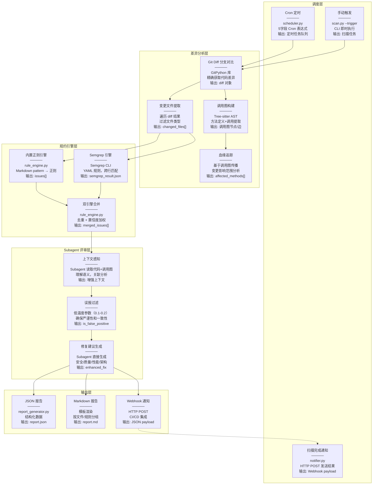

# 架构设计

---

## 工作流概览

Skill 执行时会自动完成以下步骤：

```
Step 0: 环境准备
├─ 检测 Python 版本
├─ 安装依赖（离线包优先，无需网络）
└─ 检测 Semgrep 是否可用（可选增强）

Step 1: 需求分析
├─ 识别用户意图（全量扫描/安全扫描/严格审查）
├─ 评估仓库规模（小/中/大）
└─ 选择规约 Profile（default/strict/minimal）

Step 2: 数据提取（Python 脚本辅助）
├─ Git 差异分析（提取变更文件和方法）
├─ 调用图构建（追踪血缘关系）
└─ 读取规约文件（references/）

Step 3: 规则预编译（可选，自动执行）
├─ 计算 Markdown 规则文件的 hash
├─ 检查缓存（references/compiled/）是否有效
├─ 如果 hash 变化，重新解析 Markdown
├─ golden test 验证（pattern 命中违规示例、不命中安全示例）
├─ 失败时带反馈自动修复（CEGIS 反例累积，最多 3 轮）
├─ 如果 hash 未变化，直接加载缓存
└─ 性能提升：加载速度提升 50%（17ms -> 8ms）

Step 4: 多引擎融合评审（核心）
├─ 加载规约文件（优先使用预编译缓存）
├─ Semgrep 引擎扫描（pattern 匹配）
├─ Tree-sitter AST 引擎扫描（精确语法分析）
├─ 内置正则引擎扫描（回退方案）
├─ 多引擎结果去重合并（AST > Semgrep > Regex 优先级）
├─ 生成结构化问题列表
└─ 生成 subagent 评审任务文件

Step 5: 子 Agent 评审（主 Agent 委派）
├─ 主 Agent 读取 config.yaml 中的温度参数
├─ 主 Agent 委派子 Agent 执行代码评审
├─ 子 Agent 使用低温度参数（0.1-0.2）确保严谨性
├─ 可选：投票模式（voting.votes=3）多次采样取多数票
├─ 子 Agent 分析代码上下文，过滤误报
└─ 返回结构化评审结果

Step 6: 报告生成（Python 脚本辅助）
├─ 格式化报告（JSON + Markdown）
├─ 统计摘要（按规约类型、严重等级、文件维度）
└─ 输出到 report/ 目录
```

详细工作流说明请参考 [SKILL.md](../.trae/skills/code-review/SKILL.md)。

---


---

## 技术栈

### 核心技术层次

```
Level 3: Subagent 评审（核心）
├─ TRAE Agent 委派 subagent 执行代码评审
├─ 低温度参数（0.1-0.2）确保严谨性和一致性
├─ 上下文理解，过滤误报
└─ 生成修复建议和分析说明
    ↓
Level 2: 多引擎融合扫描
├─ Semgrep 引擎：跨行模式匹配、数据流分析
├─ Tree-sitter AST 引擎：精确语法分析、减少误报
├─ 内置正则引擎：回退方案
├─ 去重合并：同一文件/行/规则的问题自动去重
└─ 引擎优先级：AST > Semgrep > Regex
    ↓
Level 1: Tree-sitter AST 解析（精确语法分析）
├─ 方法定义提取（比正则更准确）
├─ 调用图构建（方法间调用关系）
├─ 多语言支持（Java/Python/JavaScript）
└─ 离线可用（已集成）
    ↓
Level 0: Git 差异分析（变更检测）
├─ 分支对比（release vs master）
├─ 变更文件提取
├─ 变更方法定位
└─ 离线可用（已集成）
```

### 技术选型对比

| 技术 | 精准度 | 性能 | 适用场景 | 外部依赖 | 当前状态 |
|------|--------|------|----------|----------|----------|
| **Subagent 评审** | ⭐⭐⭐⭐⭐ | ⭐⭐⭐⭐ | 低温度参数确保严谨性 | 无（TRAE Agent 委派） | ✅ 已集成 |
| **Semgrep** | ⭐⭐⭐⭐⭐ | ⭐⭐⭐ | 跨行模式、数据流分析 | 需安装 | ✅ 已集成（多引擎之一） |
| **Tree-sitter** | ⭐⭐⭐⭐⭐ | ⭐⭐⭐⭐ | AST 解析、调用图 | 无 | ✅ 已集成 |
| **GitPython** | ⭐⭐⭐⭐ | ⭐⭐⭐⭐ | 分支差异、变更检测 | 无 | ✅ 已集成 |

### 外部依赖分析

| 依赖 | 是否必须 | 用途 | 离线可用 |
|------|----------|------|----------|
| **Python 3.8+** | ✅ 必须 | 运行环境 | ✅ |
| **pyyaml** | ✅ 必须 | YAML 解析 | ✅ |
| **gitpython** | ✅ 必须 | Git 操作 | ✅ |
| **tree-sitter** | ✅ 必须 | AST 解析 | ✅ |
| **rich** | ✅ 必须 | 终端输出 | ✅ |
| **Semgrep** | ❌ 可选 | 精准模式匹配 | ✅（如果已安装） |
| **外部 LLM API** | ❌ 不需要 | AI Agent 本身就是 LLM | - |

**核心优势**：所有核心功能离线可用，无需外部 API 调用。AI Agent 直接分析扫描结果，无需额外调用 LLM API。


---

## 多引擎融合架构

### 引擎组成

本工具采用三引擎融合架构，通过不同分析层次的互补，提高扫描准确性并减少误报：

| 引擎 | 分析层次 | 精准度 | 特点 | 状态 |
|------|---------|--------|------|------|
| **Semgrep** | Pattern 匹配（基于 AST） | ⭐⭐⭐⭐⭐ | 跨行模式、数据流分析、多语言支持 | ✅ 主力引擎 |
| **Tree-sitter AST** | 语法树分析 | ⭐⭐⭐⭐⭐ | 精确语法分析、控制流理解、显著减少误报 | ✅ 补充引擎 |
| **内置正则** | 文本匹配 | ⭐⭐⭐ | 快速、无需外部依赖、回退方案 | ✅ 回退引擎 |

### 融合策略

```
扫描流程：
1. Semgrep 引擎扫描 → 发现 N1 个问题
2. Tree-sitter AST 引擎扫描 → 发现 N2 个问题
3. 内置正则引擎扫描（Semgrep 不可用时）→ 发现 N3 个问题
4. 多引擎结果去重合并：
   - 去重规则：同一文件、同一行、同一规则 ID 视为重复
   - 保留优先级：AST > Semgrep > Regex（AST 最精确）
5. 输出最终问题列表
```

### 验证案例

#### 案例 1：test-validation/ 测试仓库

```bash
$ python3 scripts/scan.py --repo test-validation/ --full-scan
```

**扫描结果**：
```
2026-08-10 08:38:48 [INFO] Semgrep 扫描完成，发现 80 个问题
2026-08-10 08:38:48 [INFO] AST 引擎扫描完成: 18 个文件, 11 个问题
2026-08-10 08:38:48 [INFO] 多引擎融合结果: Semgrep(80) + AST(11) → 去重后 69 个问题
```

**分析**：
- Semgrep 发现 80 个问题（包含部分误报）
- AST 引擎发现 11 个问题（基于精确语法分析）
- 去重后 69 个问题（AST 引擎的高优先级结果替换了部分 Semgrep 结果）
- 去重率：(80 + 11 - 69) / (80 + 11) = 24.2%

#### 案例 2：误报减少验证

**问题**：`null-java-unwrap-boxed` 规则在 Jenkins 项目中检出 633 个问题

**原因分析**：
- Semgrep pattern 匹配了 `int` 关键字
- 但没有区分基本类型和 Integer 拆箱场景
- 导致大量误报（如 `private int exit = -1;` 被误判）

**AST 引擎改进**：
- Tree-sitter AST 引擎能够精确识别变量类型
- 区分 `int`（基本类型）和 `Integer`（包装类）
- 显著减少此类误报

### 引擎优先级说明

当多个引擎对同一位置检出相同规则时，按以下优先级保留结果：

1. **AST 引擎**（优先级最高）：基于语法树分析，最精确
2. **Semgrep 引擎**：基于 pattern 匹配，准确度高
3. **内置正则**（优先级最低）：基于文本匹配，作为回退方案


---

## 工作空间机制

为避免并行扫描时的文件冲突，每次扫描都会创建独立的工作空间。

**重要**：工作空间默认创建在**被扫描项目下**，而不是在 code-review-skill 项目内，避免污染工具项目本身。

### 目录关系

```
<被扫描项目>/                           # 用户的目标项目
└── .code-review/                      # code-review 工具的输出目录（自动创建）
    └── workspace/                     # 工作空间根目录
        └── {scan_id}/                 # 扫描ID: 时间戳_随机后缀
            ├── report/                # 扫描报告
            │   ├── report.json
            │   ├── report.md
            │   ├── summary.json
            │   └── subagent-review-task.md
            ├── cache/                 # 规则编译缓存（本次扫描专用）
            │   └── compiled/
            ├── decisions/             # 决策日志
            │   └── {scan_id}.json
            ├── feedbacks.json         # Harness 反馈数据
            └── stats_cache.json       # 质量监控缓存
```

### 优势

| 特性 | 说明 |
|------|------|
| **不污染工具项目** | 所有输出都在被扫描项目下，code-review-skill 项目保持干净 |
| **完全隔离** | 每次扫描的所有输出都在独立目录，互不干扰 |
| **可追溯** | 通过 scan_id 可以追踪完整的扫描历史 |
| **支持并行** | 多个扫描可以同时运行，不会冲突 |
| **易于清理** | 可以按 scan_id 删除旧的扫描结果 |

### 使用示例

```bash
# 扫描 test-validation 项目
$ python3 scripts/scan.py --repo test-validation/ --full-scan
工作空间已创建: test-validation/.code-review/workspace/2026-08-10_14-45-11_044a

# 扫描 Jenkins 项目（同时运行）
$ python3 scripts/scan.py --repo /path/to/jenkins --full-scan
工作空间已创建: /path/to/jenkins/.code-review/workspace/2026-08-10_14-45-12_ab12

# 查看扫描结果
$ ls test-validation/.code-review/workspace/
2026-08-10_14-45-11_044a/

$ ls test-validation/.code-review/workspace/2026-08-10_14-45-11_044a/
report/  cache/  decisions/  feedbacks.json  stats_cache.json
```

### 清理旧工作空间

```bash
# 删除被扫描项目下 7 天前的工作空间
find test-validation/.code-review/workspace/ -maxdepth 1 -type d -mtime +7 -exec rm -rf {} \;
```


---

## 架构总览



### 架构说明

上图展示了代码评审工具的完整数据流。每个方格包含四行信息：
- **第一行**：模块名称
- **第二行**：实现方式（核心代码/技术）
- **第三行**：功能效果
- **第四行**：输出数据格式

**数据流向**：
1. **调度层** → 触发扫描任务（Cron 定时 / 手动触发两种方式）
2. **差异分析层** → 提取变更文件和调用关系（Git Diff + Tree-sitter）
3. **规约引擎层** → 双引擎并行扫描（内置正则 + Semgrep）
4. **Subagent 评审层** → TRAE Agent 委派 subagent，使用低温度参数（0.1-0.2）确保严谨性和一致性
5. **输出层** → 生成报告和通知（JSON/Markdown/Webhook）
6. **扫描完成通知** → 通过 Webhook 将结果发送到外部系统

---


---

## 各层实现原理详解

### 调度层

| 模块 | 实现方式 | 效果 | 输出 |
|------|----------|------|------|
| **Cron 定时** | `scheduler.py` 内置 Cron 解析器，支持标准 5 字段表达式 | 定期自动触发扫描，无需人工干预 | 定时任务队列 |
| **手动触发** | `scan.py --trigger` CLI 参数 | 即时执行扫描，支持紧急检查 | 立即启动扫描流程 |
| **扫描完成通知** | `notifier.py` 通过 HTTP POST 发送扫描结果 | 将结果推送到外部系统（钉钉/飞书/Slack 等） | JSON payload |

### 差异分析层

| 模块 | 实现方式 | 效果 | 输出 |
|------|----------|------|------|
| **Git Diff 分支对比** | GitPython 库，`repo.commit(base).diff(target)` | 精确获取两个分支的代码差异 | 差异文件列表、变更行号 |
| **变更文件提取** | 遍历 diff 结果，过滤文件类型 | 聚焦实际代码变更，跳过二进制/配置 | `changed_files: [{path, status, additions, deletions}]` |
| **调用图构建** | Tree-sitter AST 解析，提取方法定义和调用 | 建立方法间调用关系图 | 调用图节点和边，支持多语言 |
| **血缘追踪** | 基于调用图传播变更影响 | 识别变更的上下游影响范围 | `affected_methods: [方法列表]`，变更影响扇出 |

### 规约引擎层

| 模块 | 实现方式 | 效果 | 输出 |
|------|----------|------|------|
| **内置正则引擎** | `rule_engine.py` 将 Markdown pattern 转换为正则 | 快速模式匹配，离线可用 | 问题列表 `[{rule_id, file, line, severity}]` |
| **Semgrep 引擎** | 调用 Semgrep CLI，YAML 规则格式 | 跨行模式匹配，数据流分析 | Semgrep JSON 输出，精准度高 |
| **双引擎合并** | `rule_engine.py` 内置合并逻辑，去重 | 结合两者优势，提高检出率 | 去重后的问题列表，标注检出引擎 |

> **术语说明**：本文档中"双引擎"指规约引擎层的"内置正则 + Semgrep"。Tree-sitter AST 引擎同时参与差异分析层（提供调用图分析）和规约引擎层（作为 builtin_engine_v2.py 提供精确语法分析扫描），详见"多引擎融合架构"章节。

### Subagent 评审层

| 模块 | 实现方式 | 效果 | 输出 |
|------|----------|------|------|
| **上下文感知** | Subagent 读取代码上下文、调用图、diff | 理解代码语义，避免误报 | 增强的问题上下文 |
| **误报过滤** | 低温度参数（0.1-0.2）确保严谨性和一致性 | 减少噪音，提高准确性 | `is_false_positive: bool`，`ai_confidence: float` |
| **修复建议生成** | Subagent 直接生成修复建议 | 提供针对性的修复代码 | `enhanced_fix: string`，工作流特定字段 |

**说明**：TRAE Agent 委派 subagent 执行代码评审，通过低温度参数确保严谨性和一致性。

**温度参数配置**：

温度参数可以在 `config.yaml` 中配置，支持按工作流自定义：

```yaml
review:
  subagent:
    enabled: true
    temperature:
      security: 0.1        # 安全审计需要最高严谨性
      quality: 0.2         # 代码质量评审需要较高一致性
      performance: 0.1     # 性能分析需要严谨性
      architecture: 0.2    # 架构评审需要一致性
      comprehensive: 0.1   # 综合评审需要严谨性
```

**温度参数说明**：

| 工作流 | 默认温度 | 说明 |
|--------|----------|------|
| security | 0.1 | 安全审计需要最高严谨性 |
| quality | 0.2 | 代码质量评审需要较高一致性 |
| performance | 0.1 | 性能分析需要严谨性 |
| architecture | 0.2 | 架构评审需要一致性 |
| comprehensive | 0.1 | 综合评审需要严谨性 |

**温度参数影响**：
- **低温（0.1）**：评审结果更稳定、更严谨，适合安全审计和性能分析
- **中温（0.2）**：评审结果有一定灵活性，适合代码质量和架构评审
- **高温（>0.3）**：不推荐用于代码评审，可能导致结果不稳定

#### 投票评审机制（Self-Consistency）

针对 Stanford 研究（arXiv 2502.20747）证实的"LLM 即使 temperature=0 输出仍不一致"问题，引入多次采样多数投票（Wang et al. 2022, arXiv 2203.11171，Google Self-Consistency 论文验证 40 次采样可提升准确率 17.9 个百分点）。

```yaml
ai:
  voting:
    votes: 3   # 3 票采样，至少 2 票一致才保留；默认 1（禁用投票）
```

| 设计决策 | 说明 |
|----------|------|
| **默认关闭** | `voting.votes` 未配置时行为与旧版完全一致（单次评审） |
| **多数票阈值** | `votes // 2 + 1`（3 票需 >= 2 票），偶数票平票双方都丢弃，建议配置奇数 |
| **单票失败容错** | 某票 LLM 调用失败时该票 fail-open（保留全部），投票流程不崩溃 |
| **状态隔离** | 每票深拷贝输入，避免 `ai_confidence` 等字段跨票污染 |
| **审计语义** | 逐票 kept/dropped 决策记录不进入审计轨迹（避免 total_input 虚增 votes 倍），投票后写入最终裁决，`reason` 字段含投票计数（如 `majority_vote: 2/3 票`），可追溯 |
| **已知权衡** | 各工作流温度 0.1~0.2 下三票高度相关，投票收益依赖采样多样性，可能退化为 3 倍调用成本（叠加每票 max_retries=2 最坏 9 次调用）。成本敏感场景保持默认关闭 |

**维护承诺**：投票逻辑为纯计数（约 30 行核心代码），无统计概念，中级工程师 10 分钟内可理解排障。

#### 规则编译验证与修复（CEGIS 模式）

规约预编译器（`rule_compiler.py`）在 AI 生成 pattern 后执行"生成 -> 验证 -> 反馈修复"循环，借鉴 CEGIS（Counterexample-Guided Inductive Synthesis）的反例累积思想：

```
AI 生成 pattern（第 1 次）
       ↓
   golden test（pattern 必须命中违规示例、不命中安全示例）
       ↓ 失败
   累积失败反馈（"第 N 轮失败：漏检/误报"）
       ↓
   带全部历史失败重新生成（LLM 看到每一轮失败原因，避免重复犯错）
       ↓
   重复直到通过 / 预算耗尽（MAX_REPAIR_ROUNDS = 3）
```

| 机制 | 说明 |
|------|------|
| **反例累积** | 每轮失败原因追加进 failure_history，下一轮 prompt 携带全部历史（不会只看到最近一次失败） |
| **预算上限** | 最多 1 次初始生成 + 3 次修复 = 4 次 LLM 调用，防无限循环 |
| **记账规则** | 只有会触发下一轮修复的失败才记录进 prompt；预算耗尽的最后一轮失败由 `validation=failed` 表达，`repair_rounds` 恒等于实际修复轮数 |
| **通过率阈值** | `validation.pass_rate` 字段（命中违规 + 不误报安全示例的测试通过比例），部署闸门 `pass_rate < 0.9` 拒绝部署 |
| **向后兼容** | 无 `pass_rate` 字段的旧规则不受阈值影响 |

**验证结果字段**（写入规则元数据，可追溯）：

```yaml
metadata:
  validation:
    status: passed | failed | skipped
    bad_matched: true       # 违规示例是否命中（检出能力）
    good_matched: false     # 安全示例是否误报（精确性）
    pass_rate: 1.0          # 测试通过率（部署闸门 >= 0.9）
    repair_rounds: 1        # 经历几轮修复（0 = 一次通过）
```

### 输出层

| 模块 | 实现方式 | 效果 | 输出 |
|------|----------|------|------|
| **JSON 报告** | `report_generator.py` 序列化问题列表 | 结构化数据，便于程序处理 | `report.json`，包含所有问题详情 |
| **Markdown 报告** | 模板渲染，按文件/规则分组 | 人类可读，便于审查 | `report.md`，包含统计摘要和修复建议 |
| **Webhook 通知** | HTTP POST 到配置的 URL | 集成 CI/CD 流水线，实时通知 | JSON payload，包含扫描结果摘要 |

---


---

## 项目结构

```
code-review-skill/
├── .trae/skills/code-review/
│   └── SKILL.md              # Agent Skill 定义（含完整工作流）
├── docs/                     # 文档目录
│   ├── guides/               # 使用指南
│   ├── reports/              # 报告目录
│   ├── SUBAGENT-REVIEW-ARCHITECTURE.md  # Subagent 委派评审架构
│   └── *.md                  # 项目文档
├── references/               # 规约库（Markdown 格式，人机都好维护）
│   ├── design/               # 设计规约（架构、API、数据库）
│   ├── implementation/       # 代码实现规约（命名、异常、并发、空指针）
│   ├── security/             # 安全规约（12 类，覆盖 OWASP Top 10）
│   ├── rules/                # 自定义业务规则
│   ├── profiles/             # 规约配置（YAML，控制启用哪些规约）
│   ├── prompts/              # AI 评审工作流提示词（5 种工作流）
│   └── test-cases/           # 测试案例（验证规则是否正确生效）
│       ├── security/         # 安全规约测试案例
│       ├── design/           # 设计规约测试案例
│       └── implementation/   # 实现规约测试案例
├── scripts/                  # Python 工程脚本
│   ├── scan.py               # 主扫描入口
│   ├── diff_analyzer.py      # 分支差异分析与全库扫描
│   ├── call_graph.py         # 调用图构建与血缘分析
│   ├── rule_engine.py        # 规则引擎（Semgrep 集成，可选）
│   ├── rule_compiler.py      # 规则预编译器（Markdown → JSON 缓存）
│   ├── builtin_engine_v2.py  # 内置引擎 V2（基于 Tree-sitter）
│   ├── ai_reviewer.py        # AI 增强评审器（多工作流）
│   ├── report_generator.py   # 报告生成（JSON + Markdown）
│   ├── harness.py            # Harness 客户端（决策日志、反馈闭环）
│   ├── scheduler.py          # Cron 定时调度器
│   ├── notifier.py           # Webhook 通知器
│   └── test_rules.py         # 规则测试脚本
├── test-validation/          # 测试验证数据
├── tests/                    # 单元测试
├── offline-packages/         # 核心离线依赖包（44 个包，约 104MB，支持多平台）
├── semgrep-offline-packages/ # Semgrep 离线依赖包（70 个包，约 76MB，可选）
├── config.yaml                    # 全局配置
├── requirements.txt               # Python 依赖
├── install-offline.sh             # 智能离线安装脚本（跨平台）
├── install-semgrep-offline.sh     # Semgrep 离线安装（Unix）
├── install-semgrep-offline.ps1    # Semgrep 离线安装（Windows）
├── download-offline-packages.sh   # 离线包下载脚本
└── README.md
```

详细目录结构说明请参考 [DIRECTORY-STRUCTURE.md](DIRECTORY-STRUCTURE.md)。

---


---

## 能力域地图

### 核心能力覆盖

| 能力域 | 实现状态 | 技术方案 | 说明 |
|--------|----------|----------|------|
| **分支 Diff 扫描** | ✅ 已实现 | GitPython | 支持 `--base` / `--target` 分支对比 |
| **调用链/血缘分析** | ✅ 已实现 | Tree-sitter | 方法级调用图，影响范围追踪 |
| **自定义规约体系** | ✅ 已实现 | Markdown + YAML | 分层目录（设计/实现/安全），Profile 配置 |
| **安全漏洞检测** | ✅ 已实现 | 双引擎 | 12 类安全规约，覆盖 OWASP Top 10 |
| **Subagent 委派评审** | ✅ 已实现 | TRAE Agent 委派 | 低温度参数（0.1-0.2）确保严谨性和一致性 |
| **定期扫描调度** | ✅ 已实现 | Cron + Webhook | 定时扫描 + 结果通知 |
| **CI/CD 集成** | ✅ 已实现 | CLI | 可嵌入 GitHub Actions / GitLab CI |
| **离线运行** | ✅ 已实现 | 无外部依赖 | 核心功能全部离线可用 |

### 与业界工具能力对比

| 能力域 | 本项目 | Semgrep | CodeQL | SonarQube | Open Code Review |
|--------|--------|---------|--------|-----------|------------------|
| 分支 Diff 扫描 | ✅ 原生 | ✅ baseline | ✅ PR 集成 | ✅ PR 装饰器 | ✅ --from/--to |
| 调用链/血缘分析 | ✅ Tree-sitter | ⚠️ 数据流 | ✅ 污点追踪 | ⚠️ 有限 | ⚠️ 上下文窗口 |
| 自定义规约体系 | ✅ Markdown | ✅ YAML | ✅ QL 查询 | ✅ 插件 | ✅ 项目/用户规则 |
| 安全漏洞检测 | ✅ 12 类 | ✅ OWASP Top 10 | ✅ 全覆盖 | ✅ 安全热点 | ⚠️ 4 类微调规则 |
| Subagent 委派评审 | ✅ 低温度参数 | ❌ | ❌ | ❌ | ✅ 混合架构 |
| 离线运行 | ✅ 完全离线 | ✅ | ❌ 需云端 | ❌ 需服务端 | ⚠️ 需 API |
| 定期扫描调度 | ✅ 内置 Cron | ⚠️ 需外部 | ✅ GitHub | ✅ 内置 | ❌ 需外部 |

---


